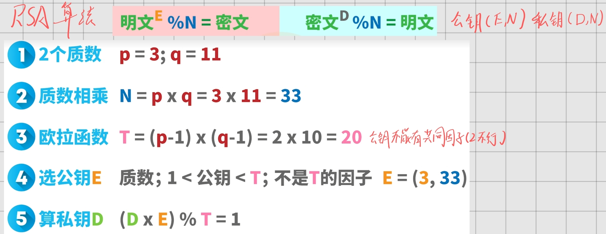

> 完整资料详见[NTU-EEE-Notes](https://github.com/zfmmmm/NTU-EEE-Notes/tree/main/src/data/blog)

[【最新&独家】EE6102-Semester-2024-2025-Final.pdf](https://raw.githubusercontent.com/zfmmmm/NTU-EEE-Notes/main/src/data/blog/EE6102/assets/【最新&独家】EE6102-Semester-2024-2025-Final/【最新&独家】EE6102-Semester-2024-2025-Final.pdf) 

 [【汇总】sld1~6.pdf](https://raw.githubusercontent.com/zfmmmm/NTU-EEE-Notes/main/src/data/blog/EE6102/assets/【汇总】sld1~6.pdf) 
## 2025-S2简答预测
### **Module 1: Cyber Security Goals, Passwords & Attacks**

**Q1: Explain the key dimensions of online security (CIA triad and extensions) and how cryptography achieves them.**
* **Confidentiality:** Keeps data secret from unauthorized access (using encryption).
* **Integrity:** Ensures data is not changed or tampered with (using hashing).
* **Authentication:** Confirms the identity of users or systems (using digital signatures/certificates).
* **Non-repudiation:** Prevents denial of sending/receiving a message (using digital signatures).

**Q2: Discuss the advantages and limitations of password-based authentication. Provide policy recommendations for password security.**
* **Advantages:** Easy to use, built into all systems, no extra setup, simple to reset.
* **Limitations:** Often weak, easy to guess, vulnerable to brute-force and dictionary attacks.
* **Policies:** Use strong passwords, update regularly, train users, enforce 2FA/MFA.

**Q3: It is recommended to use long passwords for online accounts, yet bank ATM PINs are only 4 to 6 digits long. Explain why short ATM PINs are still considered safe compared to long online passwords.**
* **Manual Entry:** ATM PINs are entered slowly in person; online passwords can be attacked quickly by bots.
* **Lockout:** ATMs limit attempts (e.g., 3 tries); online systems may allow many attempts.
* **Risk:** ATM attackers must be physically present and visible; online attackers can hide remotely.

**Q4: Explain the concept of a Denial of Service (DoS) and Distributed Denial of Service (DDoS) attack. Describe a SYN flooding attack and the role of a Botnet.**
* **DoS/DDoS:** Floods a system with traffic to make it unavailable; DDoS uses many sources.
* **SYN Flooding:** Sends many fake connection requests, filling server resources with incomplete connections.
* **Botnet:** Network of infected devices used to generate large, distributed attack traffic.

---

### **Module 2: Network Defenses & Security Management**

**Q5: Describe the different types of firewalls and their primary functions.**
* **Packet-filtering Firewall:** Checks packets by IP/port; fast but basic security.
* **Stateful Inspection:** Tracks connections and filters based on context.
* **Proxy Firewall:** Acts as a middleman, inspects application data.
* **NGFW:** Advanced firewall with deep inspection, intrusion prevention, and app awareness.

**Q6: State the main components of an IDS and differentiate between HIDS and NIDS.**
* **Main components:** sensors (collect data), analyser (detects intrusions), user interface (alerts administrator).
* **NIDS:** Monitors network traffic for attacks; good for overall detection but limited with encrypted data.
* **HIDS:** Runs on individual devices; monitors logs and files, effective for insider threats and malware.

**Q7: Differentiate between the various types of malware (Viruses, Worms, Trojans, Ransomware, Spyware) and how to protect against them.**
* **Viruses:** Infect files; need user action to spread.
* **Worms:** Self-spread across networks automatically.
* **Trojans:** Fake legitimate apps; create backdoors.
* **Ransomware:** Locks data and demands payment.
* **Spyware:** Secretly collects user data.
* **Protection:** Use antivirus, avoid suspicious links/files, update systems, keep backups.

**Q8: What are the four tiers of the DLM model? Why must security rely on both policy and technology, and how should top management support be demonstrated?**
* **Defence-in-Depth:** Uses multiple security layers (data, application, host, network) for stronger protection.
* **Policy + Technology:** Technology enforces security, while policy defines rules; both are needed to prevent bypass and ensure compliance.
* **Top management support:** Leadership must provide resources, set policies, and enforce accountability for security to work.

**Q9: Describe the key components of an organisational cybersecurity strategy, including risk assessment and compliance.**
A cybersecurity strategy aligns security with business goals.
* **Risk assessment:** Identifies assets, threats, and weaknesses, then evaluates impact and likelihood to prioritise risks.
* **Compliance:** Follows laws and standards (e.g. GDPR, PCI-DSS) to avoid penalties and protect reputation.
* Includes policies, technology, user training, and incident response.

**Q10: How do you interpret a risk score?**
A risk score shows how serious a security risk is based on likelihood, impact, and asset value.
* High score = urgent action needed
* Medium score = needs control and monitoring
* Low score = acceptable or low priority

---

### **Module 3: Cryptography & Key Management**

**Q11: Describe Symmetric and Asymmetric key encryption systems. What major problem of the symmetric encryption system is solved by public-key encryption?**
* **Symmetric encryption:** Same key for encryption and decryption. Fast and efficient, but key sharing is risky.
* **Asymmetric encryption:** Uses a public key to encrypt and a private key to decrypt. Solves the key exchange problem.

**Q12: Explain how the Hybrid model (SSL/TLS 1.2) utilizes both symmetric and asymmetric cryptography for secure web communication.**
* **Problem:** Asymmetric encryption is slow; symmetric encryption has key exchange issues.
* **Hybrid approach:** Use RSA to securely exchange a session key, then use AES to encrypt data.
* **Result:** Secure key exchange + fast data encryption.

**Q13: Explain the concept of cryptographic hashing. How does it work and how does it provide integrity?**
* **Hashing:** Converts data into a fixed-size value (digest).
* **Integrity:** Any small change in data changes the hash, so differences show tampering.

**Q14: Describe the process of generating and verifying a Digital Signature. Explain the roles of the public key, private key, and hash function.**
* **Generation:** Hash the message, then encrypt the hash with the sender’s private key → digital signature.
* **Verification:** Receiver hashes the message and decrypts the signature using the sender’s public key; if both hashes match, it is valid.
* **Roles:** Private key = creates signature (non-repudiation), public key = verifies identity, hash = ensures integrity and efficiency.

**Q15: What is the purpose of a Digital Certificate in the context of public-key cryptography?**
* **Digital Certificate:** An electronic ID that links a public key to a real identity.
* **Issued by:** A trusted Certificate Authority (CA).
* **Purpose:** Confirms the public key is genuine and prevents fake key attacks (e.g., man-in-the-middle).

---

### **Module 4: RSA, Diffie-Hellman & Forward Secrecy**

**Q16: Explain the mathematical foundation of the RSA algorithm. Why is it considered secure?**
* **RSA basis:** Uses prime numbers and factorization.
* **Key idea:** Multiplying large primes is easy, but factoring the result back is extremely hard.
* **Security:** This difficulty protects the private key.

**Q17: Explain how RSA is used for digital signatures.**
* **Signing:** Sender uses private key to create signature (S = Mᵈ mod n).
* **Verification:** Receiver uses public key to check it (M′ = Sᵉ mod n). If it matches, it’s valid.
* **Result:** Ensures authentication (real sender) and non-repudiation (cannot deny signing).

**Q18: Compare DES, AES, and RC4 in terms of type, key size, block size, and current security.**

| Algorithm | Type | Key size | Block size | Security |
| :--- | :--- | :--- | :--- | :--- |
| DES | Block cipher | 56 bits | 64 bits | Insecure, broken by brute force |
| AES | Block cipher | 128/192/256 bits | 128 bits | Very secure, widely adopted |
| RC4 | Stream cipher | Variable (often 40‑2048 bits) | N/A | Insecure, deprecated |

**Q19: Briefly describe the main purpose of the Diffie-Hellman key exchange protocol. What mathematical problem does it rely on?**
* **Purpose:** Lets two people create a shared secret key over an insecure channel without sharing it directly.
* **Basis:** Uses the discrete logarithm problem.
* **Key idea:** Easy to compute powers in modular math, but very hard to reverse-engineer the exponent.

**Q20: Explain the concept of Perfect Forward Secrecy (PFS). Why was the RSA algorithm replaced by Ephemeral Diffie-Hellman (EDH) in the TLS 1.3 protocol?**
* **Forward secrecy:** Past sessions stay secure even if the server key is stolen later.
* **RSA issue:** Same long-term key; if it’s compromised later, old traffic can be decrypted.
* **EDH solution:** Uses temporary session keys (new each time, then deleted), so past data cannot be decrypted even after a breach.

---

### **Module 5: Blockchain Technology & DeFi**

**Q21: Describe the core components of blockchain technology and the benefits they offer.**
* **Immutable ledger:** Shared records that cannot be changed or deleted.
* **Encryption & hashing:** Secure data and detect tampering through hash changes.
* **Consensus:** Network agrees on valid transactions without a central authority (e.g. PoW/PoS).
* **Smart contracts:** Automatic code that executes agreements without intermediaries.

**Q22: Critically analyze the core components of blockchain architecture:**
* **Immutable ledger:** Once data is added, it cannot be changed or deleted.
* **Decentralized peers:** Many nodes maintain the system, no central control or single point of failure.
* **Encryption & hashing:** Secure data and link blocks; any change breaks the chain.
* **Consensus:** Nodes agree on transactions (e.g. PoW/PoS) without a central authority.
* **Smart contracts:** Automatic programs that execute when conditions are met, removing intermediaries.

**Q23: How does blockchain provide efficiency, transparency, and trust for business applications?**
* **Transparency:** Transactions are visible to allowed participants, creating a shared record.
* **Trust:** Relies on cryptography and consensus instead of a central authority.
* **Efficiency:** Smart contracts automate processes, reducing time, cost, and manual work.

**Q24: Compare and contrast the three major types of blockchain technology.**
* **Public blockchain:** Open to everyone; anyone can join and validate transactions. Secure but slower (e.g., Bitcoin, Ethereum).
* **Private blockchain:** Controlled by one organization; only approved users can access. Faster but less decentralized.
* **Consortium blockchain:** Managed by a group of organizations; semi-decentralized and used for shared business networks (e.g., banks, supply chains).

**Q25: Differentiate between Proof of Work (PoW) and Proof of Stake (PoS) consensus algorithms.**
* **PoW (Proof of Work):** Miners solve complex puzzles using high computing power to add blocks. Secure but slow and energy-intensive.
* **PoS (Proof of Stake):** Validators are chosen based on how much crypto they stake. Faster, more efficient, and eco-friendly. More eco-friendly because it avoids energy-heavy mining and large-scale hashing computations.

**Q26: Compare Bitcoin, Ethereum, and Ripple.**
* **Bitcoin:** First crypto, like “digital gold”; uses PoW, slow transactions, high energy use.
* **Ethereum:** Supports smart contracts and dApps; now uses PoS; faster and more scalable but fees can vary.
* **Ripple (XRP):** Fast, low-cost payments for banks; more centralized and faces regulatory issues.

**Q27: Describe the basic concept of Cryptocurrency and the typical Bitcoin transaction process.**
* **Cryptocurrency:** Digital money secured by cryptography, running on decentralized blockchain without banks.

* **Transaction process:**
  1. User sends a transaction.
  2. It is grouped into a block.
  3. Block is shared across the network.
  4. Nodes verify it using consensus (e.g. PoW).
  5. Block is added to the blockchain.
  6. Transaction is completed.

**Q28: What is Decentralized Finance (DeFi)? Discuss its benefits, limitations, and future prospects.**
* **DeFi:** Financial services (like lending and trading) built on blockchain using smart contracts, without banks.
* **Benefits:** Decentralized, open to anyone, lower fees, 24/7 access.
* **Limitations:** High price volatility, smart contract security risks, complex to use.
* **Future:** Could make finance more accessible globally if security and regulation improve.

**Q29: What are smart contracts, and what advantages do they bring to DeFi?**
* **Smart contracts:** Self-executing programs on blockchain that run when conditions are met.
* **DeFi advantages:**
  * No intermediaries (no banks/brokers)
  * Transparent and secure (auditable code)
  * Lower costs
  * Automatic and instant execution
  * Available 24/7 anywhere

### Diffie-Hellman 密钥交换协议
**底层逻辑:** 基于离散对数问题 (Discrete Logarithm Problem) 构建的单向函数 。允许双方在公共互联网上协商出一个共享密钥，而不在网络上传输该密钥 。

**【考试重点计算：推导共享密钥】**
假设 Alice 和 Bob 同意使用素数 $p=23$ 和底数 $g=5$ 。
1.  **Alice 的计算:** 选择私有整数 $a=6$，计算并发送公钥 $A = g^a \pmod{p}$ 。
    计算: $A = 5^6 \pmod{23} = 8$ 。
2.  **Bob 的计算:** 选择私有整数 $b=15$，计算并发送公钥 $B = g^b \pmod{p}$ 。
    计算: $B = 5^{15} \pmod{23} = 19$ 。
3.  **生成共享密钥 (Shared Key, $s$):**
    Alice 收到 B，计算 $s = B^a \pmod{p} = 19^6 \pmod{23} = 2$ 。
    Bob 收到 A，计算 $s = A^b \pmod{p} = 8^{15} \pmod{23} = 2$ 。
双方成功共享了密钥 $s=2$ 。

**理论延展：完全前向保密 (PFS - Perfect Forward Secrecy):** 在传统的 TLS 1.2 中，如果攻击者记录了所有密文，多年后破解了永久的 RSA 私钥，就可以解密所有历史数据 。TLS 1.3 引入了短暂的 Diffie-Hellman (EDH, Ephemeral Diffie-Hellman)，每次会话生成新密钥，用完即毁，从而提供 PFS 保护 。

### RSA 加密算法与数字签名体系
**底层逻辑:** 基于大数分解的数学难题。两个大素数相乘极其容易，但要把乘积重新分解为两个素数则几乎不可能 。

**【考试重点计算：RSA 全生命周期推导】**
考试时**绝对不会提供公式**，你必须默写并代入 。
假设选择两个素数 $p=11$, $q=3$ 。

**步骤 1: 密钥生成 (Key Generation)**
* 计算模数 $n = p \times q = 11 \times 3 = 33$ 。
* 计算欧拉函数 $\phi(n) = (p-1) \times (q-1) = 10 \times 2 = 20$ 。
* **选择公钥 $e$ 的规则:** $e$ 必须与 $\phi(n)$ 互质（没有共同的质因数）。对于 $\phi(n)=20$（因子为 2, 5），不能选 1，不能选 2（偶数永远不行），可以选 3 。
* **计算私钥 $d$:** 满足公式 $e \times d = 1 \pmod{\phi(n)}$，即 $e \times d = k \cdot \phi(n) + 1$ 。
    计算: $d = (k \cdot \phi(n) + 1) / e$ 。
    当 $k=1$ 时，$d = (20 + 1) / 3 = 7$ 。
    至此，公钥为 $(n,e) = (33,3)$，私钥为 $(n,d) = (33,7)$ 。

**步骤 2: 加密与解密过程**
* **加密 (Encryption):** 使用接收方的**公钥**。公式: $C = M^e \pmod{n}$ 。
    若明文 $M=8$，则密文 $C = 8^3 \pmod{33} = 17$ 。
* **解密 (Decryption):** 使用接收方的**私钥**。公式: $M = C^d \pmod{n}$ 。
    还原: $M = 17^7 \pmod{33} = 8$ 。

**步骤 3: 数字签名生成与验证 (Digital Signature)**
* **生成签名 (Generation):** 发送方使用自己的**私钥**对信息 (或信息的哈希摘要) 进行签名。公式: $S = M^d \pmod{n}$ 。
    若信息 $M=8$，签名 $S = 8^7 \pmod{33} = 2$ 。
* **验证签名 (Verification):** 接收方使用发送方的**公钥**验证。公式: $M = S^e \pmod{n}$ 。
    验证: $M = 2^3 \pmod{33} = 8$ 。能够成功还原信息，证明确实是由拥有该私钥的人签发的 。

