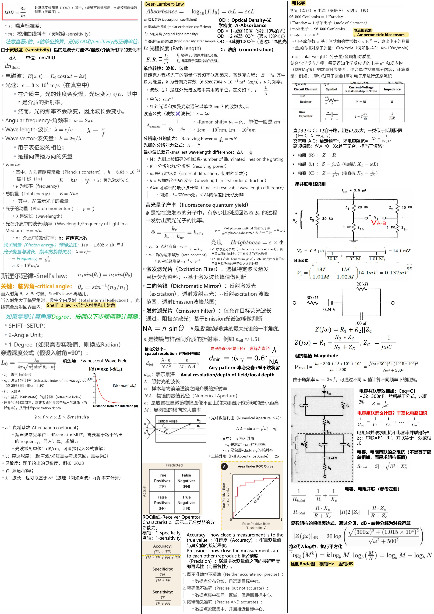
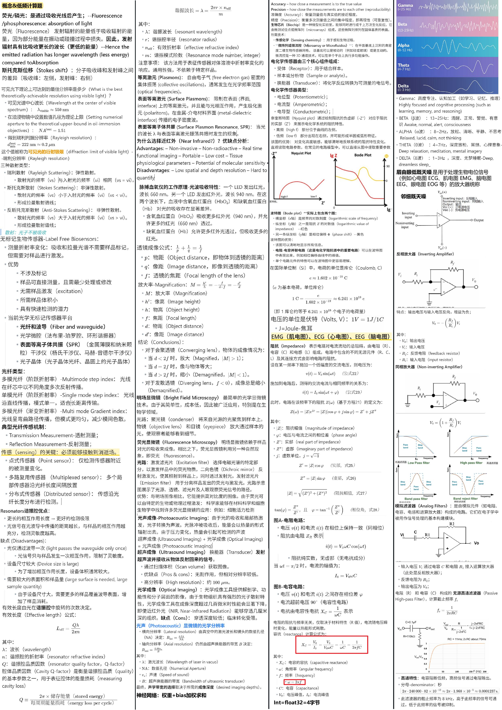

> 完整资料详见[NTU-EEE-Notes](https://github.com/zfmmmm/NTU-EEE-Notes/tree/main/src/data/blog)

 [25S2-EE6301字幕（week1-13）](https://raw.githubusercontent.com/zfmmmm/NTU-EEE-Notes/main/src/data/blog/EE6301/assets/EE6301.zip) 、[EE6301-Final-Cheetsheet.pdf](https://raw.githubusercontent.com/zfmmmm/NTU-EEE-Notes/main/src/data/blog/EE6301/assets/EE6301-Final-Cheetsheet.pdf)  、[【Final试卷】EE6301.pdf](https://raw.githubusercontent.com/zfmmmm/NTU-EEE-Notes/main/src/data/blog/EE6301/assets/【Final试卷】EE6301.pdf) 

