> 完整资料详见[NTU-EEE-Notes](https://github.com/zfmmmm/NTU-EEE-Notes/tree/main/src/data/blog)
## Table of contents
# Part1

## 如何用 $V_p$判断强弱中反型区？

### 第一步：确立标尺与基准线

#### 1. $V_T$（阈值电压）：晶体管的“起跑线”

- **物理本质**：在栅极和源极之间（$V_{GS}$）需要加多大的电压，才能把半导体表面原本的载流子赶走，并吸引足够多的反型载流子（比如NMOS吸引电子），从而形成一条“勉强导通”的沟道。
- **类比**：就像是一扇带弹簧的门，$V_T$ 就是推开这扇门所需的**最小基础力量**。
- **注意点**：$V_T$ 并不是一个绝对的“0到1”的开关点。在 $V_{GS} < V_T$ 时，门其实开了一条缝，会有微弱的漏风（亚阈值漏电流）。

#### 2. $\Delta V$（过驱动电压）：你施加的“绝对掌控力”

- **公式定义**：$\Delta V = V_{GS} - V_T$ （也有教材写成 $V_{OV}$ 或 $V_{DS,sat}$）。
- **物理本质**：这就是你作为设计师，在克服了基础门槛（$V_T$）之后，**额外**施加在沟道上的电场控制力。它直接决定了沟道里“电荷有多厚”。
- **类比**：如果 $V_T$ 是推开门的基础力，$\Delta V$ 就是你把门彻底撞开、让风毫无阻力吹进来的**暴力程度**。
- **在强反型区**：$\Delta V$ 是绝对的主宰。平方律公式 $I_D \propto \Delta V^2$ 就是由它决定的。

#### 3. $V_p = I_D / g_m$：连接两个世界的“通用语言”

- **物理本质**：跨导 $g_m$ 代表了“效率”（每改变1V电压，能榨出多少电流），而 $I_D$ 是你要付出的“功耗代价”。所以 $V_p$（即 $g_m / I_D$ 的倒数）衡量的是：**为了维持当前的导电状态，晶体管需要多大的等效控制电压。**
- **为什么需要它？** 因为 $\Delta V$ 到了弱反型区会变成负数（公式就崩溃了），而 $V_p$ 在任何区域都是正数，并且能完美刻画晶体管的工作状态。在工业界（比如著名的 $g_m/I_D$ 设计方法学），这就是核心指标。

在进行任何判断之前，你必须先知道当前环境下的“热噪声底线”是多少。

- **热电压 $\phi_T$**：在常温（300K）下，$\phi_T = kT/q \approx 26\text{mV}$。
- **亚阈值斜率因子 $n$**：通常在 $1.2 \sim 1.5$ 之间。
- **基准线 $n\cdot\phi_T$**：我们假设 $n=1.5$，那么基准线就是 $1.5 \times 26\text{mV} = \mathbf{39\text{mV}}$。如果工艺更好，$n$ 接近 $1.2$，基准线大约是 $\mathbf{30\text{mV}}$左右。

**核心思想：我们将算出的 $V_p$ 与这根“30~40mV的基准线”进行对比。**

------

### 第二步：三大反型区的绝对量化标准

通过 $V_p$ 的大小，我们可以把晶体管的状态极其清晰地切分为三个区间。这里我们以常温下 $n\cdot\phi_T \approx 35\text{mV}$ 为典型参考：

#### 1. 弱反型区（Weak Inversion / 亚阈值区）

- **判定标准**：**$V_p \approx n\cdot\phi_T$**
- **定量范围**：通常 $V_p$ 在 **$30\text{mV} \sim 50\text{mV}$** 之间。
- **状态特征**：此时 $V_p$ 达到了它物理上的**最小值**（因为跨导效率 $g_m/I_D$ 达到了理论最大值 $1/(n\cdot\phi_T)$）。不管你漏极电流 $I_D$ 怎么变小，$V_p$ 都不会再变小了，它被死死钉在这个常数底线上。
- **设计意义**：此时晶体管极其省电（功耗极低），且提供最大的增益潜力。但缺点是电流太小，导致速度（带宽）极慢，且噪声和失配问题严重。通常用于超低功耗医疗芯片或手表的偏置电路。

#### 2. 中反型区（Moderate Inversion）

- **判定标准**：**$n\cdot\phi_T < V_p < 3 \sim 4倍的(n\cdot\phi_T)$**
- **定量范围**：通常 $V_p$ 在 **$50\text{mV} \sim 150\text{mV}$** 之间（或 $g_m/I_D$ 在 $10 \sim 20 \text{ V}^{-1}$ 之间）。
- **状态特征**：这是一个混合区，电流的产生既靠扩散（弱反型的特征），也靠电场漂移（强反型的特征）。$V_p$ 开始脱离常量底线，缓慢上升。
- **设计意义**：这是现代模拟IC设计（特别是先进工艺节点）最爱用的区域！它在“功耗、增益、速度、带宽”之间取得了近乎完美的折中（Trade-off）。

#### 3. 强反型区（Strong Inversion）

- **判定标准**：**$V_p > 4倍的(n\cdot\phi_T)$** * **定量范围**：通常 $V_p > \mathbf{150\text{mV}}$ （典型的高速管子甚至会推到 $200\text{mV} \sim 300\text{mV}$）。
- **状态特征**：此时热运动的噪声被彻底压制，强大的过驱动电压 $\Delta V$ 完全接管了沟道。根据公式 $V_p = \Delta V / 2$，此时 $V_p$ 和过驱动电压呈严格的线性正比关系。
- **设计意义**：虽然跨导效率很低（很费电），但是绝对跨导 $g_m$ 很大，能驱动巨大的寄生电容，速度极快。高频射频（RF）电路或需要极强驱动能力的输出级通常设计在这个区域。

------

**综合跨导 $g_s$**：在亚阈值或考虑亚阈值斜率因子 $n$ 的模型中，我们定义源极跨导 $g_s = g_m + g_{mb} = n \cdot g_m$。

由此可引出小信号模型：

### 混合 $\pi$ 模型 (Hybrid-$\pi$ Model)

这是模拟 IC 设计中最通用的模型。正常情况下：$v_{bs} = v_b - v_s = 0 - v_s = -v_s$

#### 1. 结构画法

1. **节点**：画出三个端点 G、D、S。
2. **受控源**：在 D 和 S 之间画一个受控电流源，方向从 **D 流向 S**，大小为 $g_m v_{gs}$。
3. **内阻**：在 D 和 S 之间并联一个电阻 $r_o$。如果忽略沟道长度调制(Channel-length modulation)，$r_o=0$
4. **不考虑体效应**： $v_{bs} = 0$ ，第二个电流源 $g_{mb} v_{bs} = g_{mb} \times 0 = 0$。它在电路里相当于开路

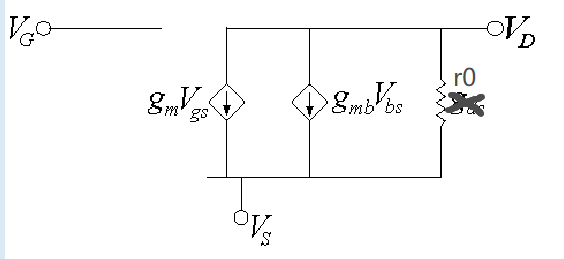

------

###  T 模型 (T-Model)

#### 1. 结构画法

1. **源极支路**：从源极 S 节点引出一个电阻，阻值为 $1/g_m$。
2. **受控源**：该电阻的另一端连接到一个受控电流源
3. **栅极**：栅极 G 连接在 $1/g_m$ 电阻和受控源的中间节点上（对于理想模型，栅极电流为 0）。

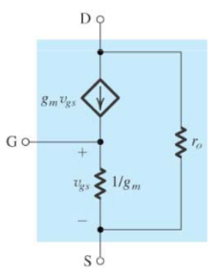

### 带宽：
$$
\tau_{OC}=\sum R_{seen,k}C_k,\qquad
f_{BW}\approx\frac1{2\pi\tau_{OC}}
$$

###  噪声：
$$
\overline{i_{sc}^2}(f)=\sum \alpha_k^2\overline{i_{n,k}^2}
$$

其中
$$
\overline{i_{n,R}^2}=4kT/R,\qquad
\overline{i_{n,MOS}^2}\approx \frac83kTg_m
$$

### 输出噪声：
$$
v_o(f)=i_{sc}(f)R_{eff}	
$$

$$
v_{o,rms}=v_o(f)\sqrt{\frac{\pi}{2}BW}
$$

### 环路增益 $L$

画出 SFG，找闭合环路的乘积

------

####  “全接触”假设下的极简公式

当我排除了“互不接触回路”，梅森增益公式瞬间从一个复杂的矩阵行列式展开，降维成了一个极其优美的代数分式：

$$H_{closed} = \frac{Y_{out}}{X_{in}} = \frac{\sum P_k}{1 - \sum L_i} = \frac{P_1 + P_2 + \dots + P_N}{1 - (L_1 + L_2 + \dots + L_M)}$$

**物理意义拆解：**

- **分子 ($\sum P_k$)**：系统所有的“攻击手段”。信号从输入端出发，有多少种不同的路径能“打”到输出端，就把它们的增益全部加起来。
- **分母 ($1 - \sum L_i$)**：系统的“防御底座”。不管外部信号怎么变，系统内部有多少个自闭合的环（无论正反馈还是负反馈），把它们的增益全部加起来，然后用 $1$ 去减。

这个公式之所以成立，是因为一个**隐藏前提**：所有的前向通路 $P_k$ 都“踩”到了所有的回路 $L_i$（所以余子式 $\Delta_k = 1$），且所有回路之间都有节点交集（所以没有 $L_i L_j$ 乘积项）。

------

一句话总结：

**把复杂信号流图拆成两件完全独立的事：先“关掉输入找所有自咬尾巴的环（决定分母稳定性）”，再“无视回路找所有从输入到输出的不回头路径（决定分子传输能力）”，最后用**
$$
H = \frac{\text{所有前向通路之和}}{1 - \text{所有闭环增益之和}}
$$
**统一拼装，并在代数层面用“大项主导”原则一刀砍掉无关小量。**

本质上，这是把“看起来纠缠的图”，强行分解成：

- **结构问题（环）→ 分母**
- **路径问题（路）→ 分子**

两者完全解耦，避免一上来被联立方程拖进泥潭。

---

1. 直流增益 (DC Gain)

$$A_{DC} = H(s) \big|_{s=0}$$

2. 右半平面零点 (RHP Zero)

$$\text{分子 (Numerator)} = 0 \quad \text{且 } \text{Re}(s) > 0$$

3. 带宽 (Bandwidth)

分母 = 0

4. 单位增益频率 (Unity Gain Frequency)

$$|H(j\omega)| = 1 \implies \text{解出 } s \text{ 或 } \omega$$

  5. 分贝增益 (Gain in dB)

  $$A_{dB} = 20 \log_{10}(|A|)$$

- **注意**：这里使用系数 20 是因为通常讨论的是电压或电流增益。如果是功率增益，系数则为 10。

6. 频率单位转换 (Frequency Conversion)

   $$f \text{ (Hz)} = \frac{\omega}{2\pi}$$

  - $f$：频率，单位为赫兹 (Hz)。
  - $\omega$：角频率，单位为弧度每秒 (rad/s)。

# Part2

> For my part, the scope for your exam study is as follows"
>
> Voltage Reference
>
> MOSFET Resistor Linearization
>
> MOSFET Resistor Characteristics
>
> MOSFET-C Filter Synthesis
>
> Design of Automatic Tuning Circuit
>
> Transistor Layout Profile.

## Voltage Reference
### 带隙基准电压源核心推导
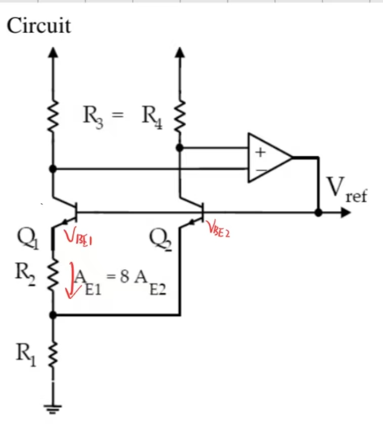

#### 1. 晶体管 $V_{BE}$ 基础公式
双极型晶体管（BJT）的基极-发射极电压 $V_{BE}$ 与集电极电流 $I_c$ 的关系公式为：
$$
V_{BE} = V_T \ln\left(\frac{I_c}{I_s}\right)
$$
其中，$V_T = \frac{kT}{q}$ 为热电压系数。

#### 2. 分别列写 $Q_1$ 与 $Q_2$ 的 $V_{BE}$ 方程
根据电路图，晶体管 $Q_1$ 的发射结面积是 $Q_2$ 的 8 倍（即 $A_{E1} = 8 A_{E2}$）。假设两支路电流相等（由运放钳位），设电流为 $I$，则有：
* **对于 $Q_1$：** $$V_{BE1} = V_T \ln\left(\frac{I}{8 \cdot \text{Area}}\right)$$
* **对于 $Q_2$：** $$V_{BE2} = V_T \ln\left(\frac{I}{1 \cdot \text{Area}}\right)$$

#### 3. 计算 $\Delta V_{BE}$（引入正温度系数项）
根据上述两式，计算两晶体管的 $V_{BE}$ 差值：
$$
 \Delta V_{BE} = V_{BE2} - V_{BE1} = V_T \ln\left(\frac{I}{\text{Area}} \cdot \frac{8 \cdot \text{Area}}{I}\right) = V_T \ln(8)
$$

#### 4. 推导支路电流与电阻 $R_1$ 的电压
由于运放的负反馈作用，两支路电流相等：
$$
 I_{Q1} = I_{Q2}
$$
流过电阻 $R_2$ 的电流为 $\frac{\Delta V_{BE}}{R_2}$，而流过底层电阻 $R_1$ 的总电流 $I_{R1}$ 是两支路电流之和，因此：
$$
 I_{R1} = 2 \times \frac{\Delta V_{BE}}{R_2}
$$
由此可以得出 $R_1$ 两端的压降 $V_{R1}$：
$$
 V_{R1} = I_{R1} \cdot R_1
$$

#### 5. 求解输出基准电压 $V_{ref}$
输出电压 $V_{ref}$ 等于 $Q_2$ 的 $V_{BE}$ 加上 $R_1$ 两端的压降：
$$
 V_{ref} = V_{BE2} + V_{R1} = V_{BE2} + \left( 2 \frac{R_1}{R_2} \ln(8) \right) \cdot V_T
$$

#### 6. 零温度系数设计
已知 $V_{BE}$ 具有负温度系数（CTAT）：
$$
\frac{\partial V_{BE}}{\partial T} \approx -2.2 \text{ mV}/^\circ\text{C}
$$
而公式后半部分的 $V_T$ 具有正温度系数（PTAT）。为了得到与温度无关的基准电压，我们令 $V_{ref}$ 对温度的导数为零：
$$
 \text{令 } \frac{\partial V_{ref}}{\partial T} = 0
$$
通过调节电阻的阻值比例来抵消温度系数，计算可得：
$$
\Rightarrow \frac{R_1}{R_2} \approx 6.2
$$

#### 7. 最终结论
当满足上述电阻比例，实现零温度系数时，该带隙基准电压的理论值为：
**此时 $V_{ref} \approx 1.25\text{V}$**

### 取自`Solution of Voltage Reference and Transconductor Excerises.pdf`

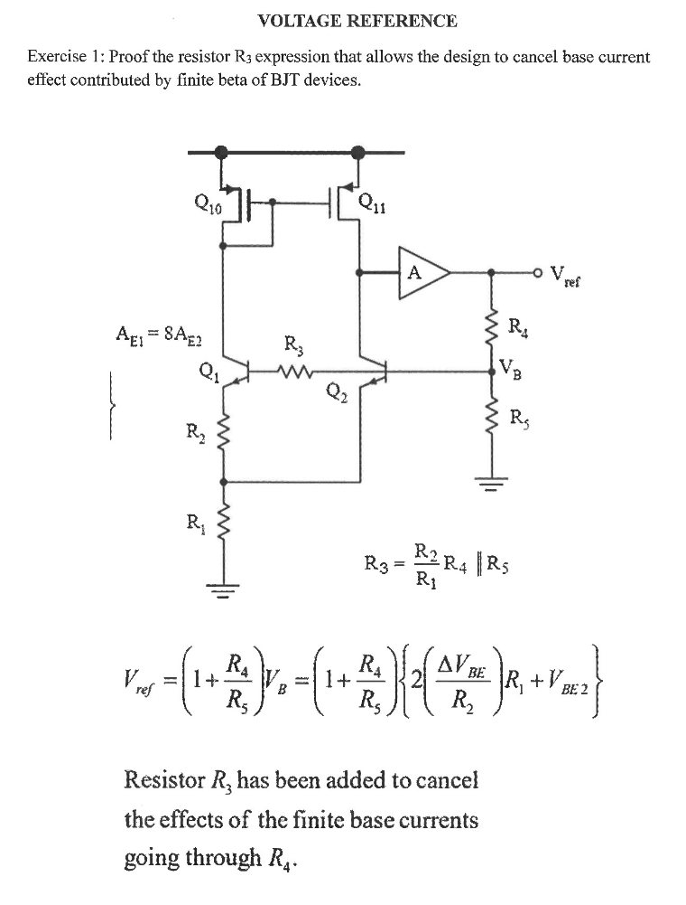

#### 题 1：为什么加一个 $R_3$ 就能抵消有限 $\beta$ 带来的 base current 误差？

##### 1. 这题在考什么？

这题本质是在考：

bandgap / voltage reference 里面，理想情况下 $V_{ref}$ 由一个 CTAT 项和一个 PTAT 项组成；但真实 BJT 的 $\beta$ 有限，会出现 base current，base current 会流到一些本来不该有电流的电阻里，从而把 $V_{ref}$ 拉偏。

题目要你证明：只要把 $R_3$ 选成某个值，这个误差就能刚好抵消。

你先记住这个总思路：

- $V_{BE}$ 是 CTAT，随温度上升而下降；
- $\Delta V_{BE}$ 是 PTAT，随温度上升而上升；
- reference 的核心就是把二者按比例加起来；
- 但 base current 会破坏这个加法，所以要做误差补偿。

##### 2. 先看“理想情况”在干什么

图里有两个双极型晶体管 $Q_1, Q_2$，面积比是

$$
A_{E1}=8A_{E2}
$$

当两个管子的电流相同、但发射结面积不同的时候，它们的 $V_{BE}$ 不一样，于是产生

$$
\Delta V_{BE}=V_{BE2}-V_{BE1}
$$

这就是 bandgap 电路最经典的“造 PTAT 电压”的方法。

这个 $\Delta V_{BE}$ 落在 $R_2$ 上，于是得到一个 PTAT 电流：

$$
I_{PTAT}=\frac{\Delta V_{BE}}{R_2}
$$

这个电流再流过 $R_1$，产生一个 PTAT 电压项。

因为下方节点上，左右两支的电流都汇到 $R_1$ 上，所以 $R_1$ 上的电流大约是两倍：

$$
I_{R1}\approx 2\frac{\Delta V_{BE}}{R_2}
$$

于是节点 $V_B$ 为

$$
V_B = V_{BE2}+2R_1\frac{\Delta V_{BE}}{R_2}
$$

这一步特别重要，你要看懂它的结构：

- $V_{BE2}$：一个 CTAT 项；
- $2R_1(\Delta V_{BE}/R_2)$：一个 PTAT 项。

然后右边 $R_4,R_5$ 只是一个放大/缩放网络，所以

$$
V_{ref}=\left(1+\frac{R_4}{R_5}\right)V_B
$$

也就是第 1 页给出的结果：

$$
V_{ref} =\left(1+\frac{R_4}{R_5}\right) \left\{ 2\left(\frac{\Delta V_{BE}}{R_2}\right)R_1+V_{BE2} \right\}
$$

这就是 理想 reference。

##### 3. 真实情况哪里出错了？

真实 BJT 不是 $\beta=\infty$，所以会有 base current：

$$
i_{b1},\;i_{b2}
$$

这两个 base current 会带来两个问题：

**问题 A：左边 $R_3$ 上会多一个压降**

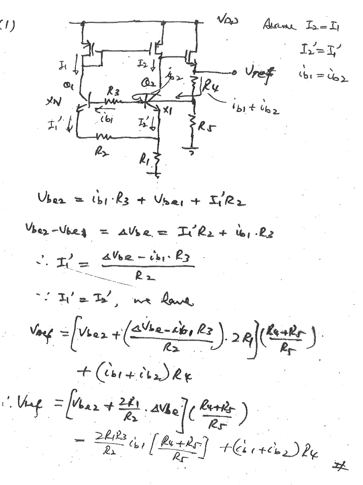

第 2 页写的是：

$$
V_{BE2}=i_{b1}R_3+V_{BE1}+I_1'R_2
$$

移项：

$$
V_{BE2}-V_{BE1}=\Delta V_{BE}=I_1'R_2+i_{b1}R_3
$$

所以

$$
I_1'=\frac{\Delta V_{BE}-i_{b1}R_3}{R_2}
$$

这里的意思是：

本来 $R_2$ 上只应该看到 $\Delta V_{BE}$，但因为 $R_3$ 上也吃掉了一点压降，所以真正流过 $R_2$ 的“有效压差”变小了，于是 PTAT 电流被拉小了。

**问题 B：右边 $R_4$ 上也会因为 base current 多掉一个电压**

右边节点 $V_B$ 不只是 divider 的电流，还要额外供给 $Q_1,Q_2$ 的 base current，所以 $R_4$ 上会多出一个误差项。

因此第 2 页把 $V_{ref}$ 写成：

$$
V_{ref}= \left[ V_{BE2}+2R_1\left(\frac{\Delta V_{BE}-i_{b1}R_3}{R_2}\right) \right] \frac{R_4+R_5}{R_5} + (i_{b1}+i_{b2})R_4
$$

把它拆开来看：

$$
V_{ref}= \underbrace{ \left[ V_{BE2}+2R_1\frac{\Delta V_{BE}}{R_2} \right] \frac{R_4+R_5}{R_5} }_{\text{理想项}} \; -\; \underbrace{ \frac{2R_1R_3}{R_2}i_{b1}\frac{R_4+R_5}{R_5} }_{\text{左边 }R_3\text{ 引入的误差}} \; +\; \underbrace{ (i_{b1}+i_{b2})R_4 }_{\text{右边 }R_4\text{ 引入的误差}}
$$

重点来了：

这题的思路不是“把误差消灭”，而是 让一个误差刚好抵消另一个误差。

##### 4. 怎么让误差抵消？

令两项误差大小相等、符号相反：

$$
\frac{2R_1R_3}{R_2}i_{b1}\frac{R_4+R_5}{R_5}= (i_{b1}+i_{b2})R_4
$$

又因为匹配情况下通常取

$$
i_{b1}=i_{b2}
$$

代入后得

$$
\frac{2R_1R_3}{R_2}i_{b1}\frac{R_4+R_5}{R_5}= 2i_{b1}R_4
$$

两边约掉 $2i_{b1}$：

$$
\frac{R_1R_3}{R_2}\frac{R_4+R_5}{R_5}=R_4
$$

整理：

$$
R_3= \frac{R_2}{R_1}\frac{R_4R_5}{R_4+R_5}= \frac{R_2}{R_1}(R_4\parallel R_5)
$$

这就是 PDF 第 1、3 页的结论：

$$
\boxed{R_3=\frac{R_2}{R_1}(R_4\parallel R_5)}
$$

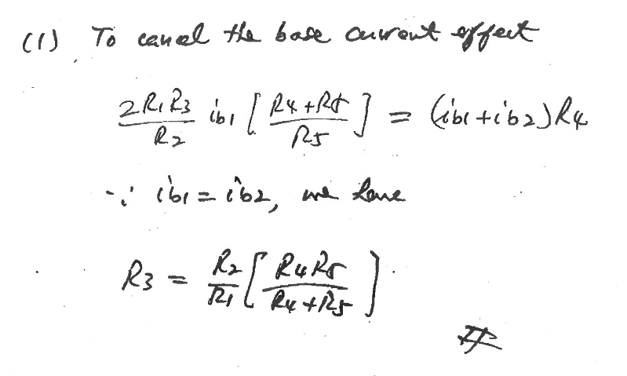

##### 5. 这题你考试时应该怎么理解？

你别把它当成“神来之笔”，本质很简单：

- base current 让右边 $R_4$ 多掉压，导致 $V_{ref}$ 偏大；
- 于是我们故意在左边加 $R_3$，让 $R_2$ 上的有效 PTAT 电流稍微变小；
- 只要 $R_3$ 选得刚好，这个“左边减小”会恰好抵消“右边增大”。

所以：

$R_3$ 不是多余元件，它是一个误差补偿电阻。

------

#### 题 2：推导这个 reference 的 $V_{REF}$

对应 PDF 第 4 页。

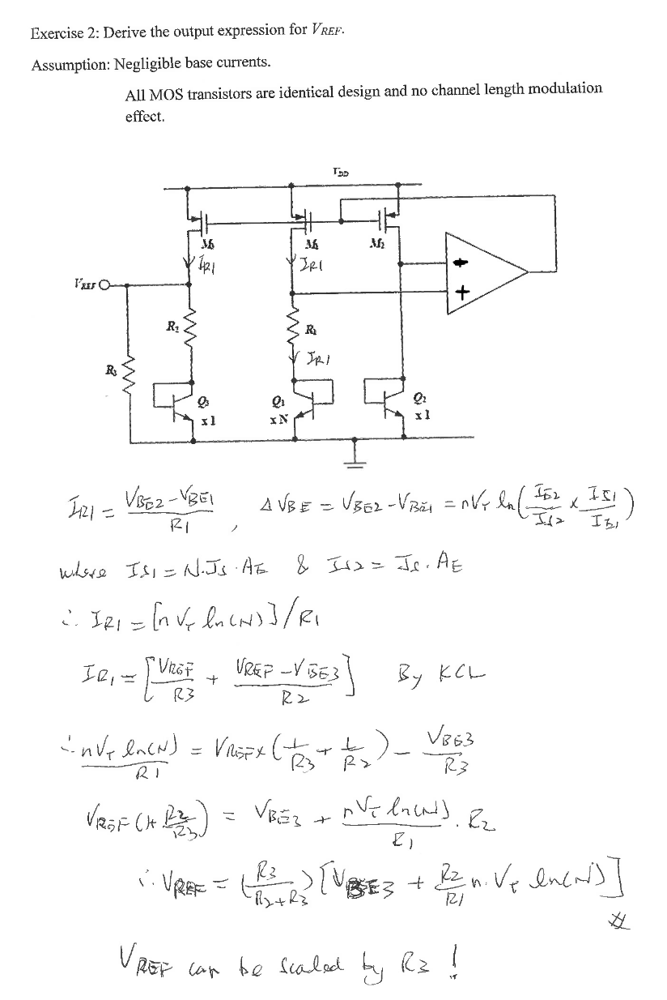

##### 1. 这题在考什么？

这题还是 bandgap / reference 的标准套路：

- 用面积比不同的 BJT 造出 $\Delta V_{BE}$；
- 用电阻把它变成 PTAT 电流；
- 再用 KCL 把 $V_{REF}$ 表达出来。

题目里明确给了假设：

- base current 可忽略；
- 所有 MOS 一样；
- 没有 channel-length modulation。

所以这题比前一题简单很多：不用管 base current 误差，纯推导。

##### 2. 第一步：先找 $\Delta V_{BE}$

图里 $Q_1$ 的面积是 $xN$，$Q_2$ 的面积是 $x1$。

运放会调节右侧支路，使得 $Q_2$ 那个上节点电压等于 $R_1$ 上端的节点电压，所以 $R_1$ 两端看到的就是

$$V_{BE2}-V_{BE1}=\Delta V_{BE}$$

因此

$$I_{R1}=\frac{V_{BE2}-V_{BE1}}{R_1} =\frac{\Delta V_{BE}}{R_1}$$

因为两个管流的是同样的电流，但面积不同，所以

$$\Delta V_{BE}=nV_T\ln(N)$$

于是

$$I_{R1}=\frac{nV_T\ln(N)}{R_1}$$

这就是 PDF 手写推导里的第一部分。

##### 3. 第二步：在 $V_{REF}$ 节点写 KCL

看左边 $V_{REF}$ 节点：

从上面灌进来的电流，就是镜像过来的那一支电流，也就是 $I_{R1}$。

这个电流会分成两条路流走：

- 一条走 $R_3$ 到地：电流为 $\dfrac{V_{REF}}{R_3}$
- 一条走 $R_2$ 再经过二极管连接的 $Q_3$ 到地：因为 $Q_3$ 顶端电压是 $V_{BE3}$，所以 $R_2$ 上电流为 $\dfrac{V_{REF}-V_{BE3}}{R_2}$

所以 KCL：

$$I_{R1} =\frac{V_{REF}}{R_3} + \frac{V_{REF}-V_{BE3}}{R_2}$$

代入前面算出的 $I_{R1}$：

$$\frac{nV_T\ln(N)}{R_1} =\frac{V_{REF}}{R_3} + \frac{V_{REF}-V_{BE3}}{R_2}$$

展开右边：

$$\frac{nV_T\ln(N)}{R_1} =V_{REF}\left(\frac{1}{R_3}+\frac{1}{R_2}\right) \frac{V_{BE3}}{R_2}$$

两边乘 $R_2$：

$$\frac{R_2}{R_1}nV_T\ln(N)= V_{REF}\left(1+\frac{R_2}{R_3}\right)-V_{BE3}$$

移项：

$$V_{REF}\left(1+\frac{R_2}{R_3}\right) =V_{BE3} + \frac{R_2}{R_1}nV_T\ln(N)$$

所以

$$\boxed{ V_{REF} =\frac{R_3}{R_2+R_3} \left[ V_{BE3} + \frac{R_2}{R_1}nV_T\ln(N) \right] }$$

这就是 PDF 第 4 页最后一行。

##### 4. 这题怎么理解最到位？

你把它看成：

$$V_{REF} = \text{缩放因子}\times(\text{CTAT}+\text{PTAT})$$

其中

- CTAT 项：$V_{BE3}$
- PTAT 项：$\dfrac{R_2}{R_1}nV_T\ln(N)$
- 缩放因子：$\dfrac{R_3}{R_2+R_3}$

所以这题的本质还是 bandgap，只不过外面多套了一个缩放网络。PDF 最后也写了：

$V_{REF}$ can be scaled by $R_3$

就是这个意思。

## MOSFET Resistor Linearization `&&` MOSFET Resistor Characteristics `&&` MOSFET-C Filter Synthesis

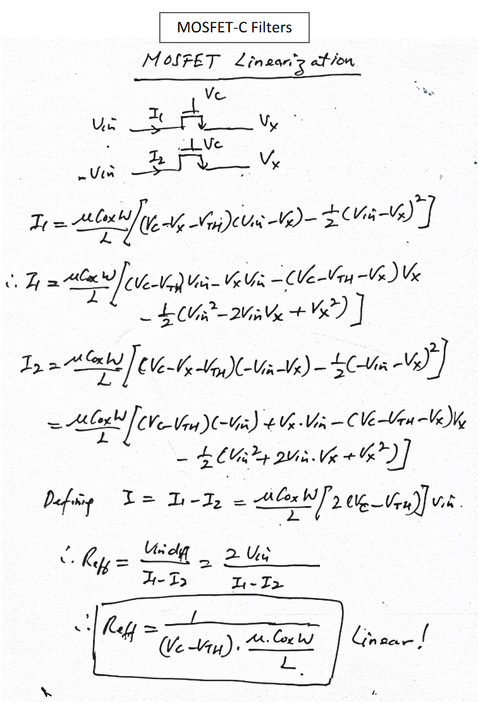

## 

**用差分结构，非线性可以在数学上被完美抹除**

### 1. 建立差分电流模型

老师画了上下两根平行的 MOSFET，并给出了两个相反的输入信号：$V_{in}$ 和 $-V_{in}$（这是全差分信号的核心特征）。它们的输出端都接到了同一个节点 $V_x$（这个 $V_x$ 通常就是运放的虚地输入端）。

我们要计算流过这两根管子的电流 $I_1$ 和 $I_2$。

### 2. 深度拆解核心推导过程 (请紧跟这里的代数化简)

老师写出了线性区 MOSFET 的经典大信号电流方程：

$$I = \mu C_{ox} \frac{W}{L} \left[ (V_{GS} - V_{TH})V_{DS} - \frac{1}{2}V_{DS}^2 \right]$$

分别代入上下两根管子的端电压：

- **对于第一根管子 ($I_1$)**：输入是 $V_{in}$，节点是 $V_x$。

  $$I_1 = \frac{\mu C_{ox} W}{L} \left[ (V_c - V_x - V_{TH})(V_{in} - V_x) - \frac{1}{2}(V_{in} - V_x)^2 \right]$$

- **对于第二根管子 ($I_2$)**：输入是 $-V_{in}$，节点也是 $V_x$。

  $$I_2 = \frac{\mu C_{ox} W}{L} \left[ (V_c - V_x - V_{TH})(-V_{in} - V_x) - \frac{1}{2}(-V_{in} - V_x)^2 \right]$$

**接下来是见证奇迹的时刻！老师计算了差分电流 $I = I_1 - I_2$。**

为什么算相减？因为后续接的运算放大器，本质上就是处理差分信号的。我们把上面的两坨公式展开并相减：

$$I_1 - I_2 = \frac{\mu C_{ox} W}{L} \left\{ \underbrace{(V_c - V_x - V_{TH})[V_{in} - (-V_{in})]}_{\text{一次项相减}} - \underbrace{\frac{1}{2} \left[ (V_{in} - V_x)^2 - (-V_{in} - V_x)^2 \right]}_{\text{二次项（平方项）相减}} \right\}$$

我们分别看这两部分：

1. **一次项相减**：中括号里变成了 $2V_{in}$。所以第一部分是 $(V_c - V_x - V_{TH})(2V_{in})$。展开得到 $2V_c V_{in} - 2V_x V_{in} - 2V_{TH} V_{in}$。

2. **二次项相减（消灭非线性的关键）**：

   $(V_{in} - V_x)^2 = V_{in}^2 - 2V_{in}V_x + V_x^2$

   $(-V_{in} - V_x)^2 = V_{in}^2 + 2V_{in}V_x + V_x^2$

   两者相减，平方项 $V_{in}^2$ 和 $V_x^2$ 瞬间灰飞烟灭！只剩下 $(-4V_{in}V_x)$。外面还有个 $-\frac{1}{2}$，乘起来就是 $\mathbf{+2V_{in}V_x}$。

把两部分加起来：

$$I_1 - I_2 = \frac{\mu C_{ox} W}{L} \left[ (2V_c V_{in} - \mathbf{2V_x V_{in}} - 2V_{TH} V_{in}) \mathbf{+ 2V_{in}V_x} \right]$$

你看出来了吗？**带有节点电压 $V_x$ 的交叉项项也被完美抵消了！**

最终结果干干净净（就是笔记中 `Defining I = I1 - I2` 那一行）：

$$I_1 - I_2 = \mu C_{ox} \frac{W}{L} (V_c - V_{TH}) 2V_{in}$$

### 3. 最终结论 (Linear!)

有了差分电流，我们就可以求出**差分等效电阻 $R_{eff}$**：

电压差是 $V_{in} - (-V_{in}) = 2V_{in}$，电流差是 $I_1 - I_2$。

$$R_{eff} = \frac{V_{in\_diff}}{I_1 - I_2} = \frac{2V_{in}}{I_1 - I_2} = \frac{1}{\mu C_{ox} \frac{W}{L} (V_c - V_{TH})}$$

老师在笔记右下角重重地写下了 **"Linear!"**。

这意味着，只要你保证提供一对正负对称的信号，并在输出端取差流，这个等效电阻就**只与控制电压 $V_c$ 和工艺参数有关，绝对与输入信号 $V_{in}$ 的大小无关，也与运放虚地节点电压 $V_x$ 的波动无关**。这就是 MOSFET-C 能做成高精度芯片的理论基石。

---

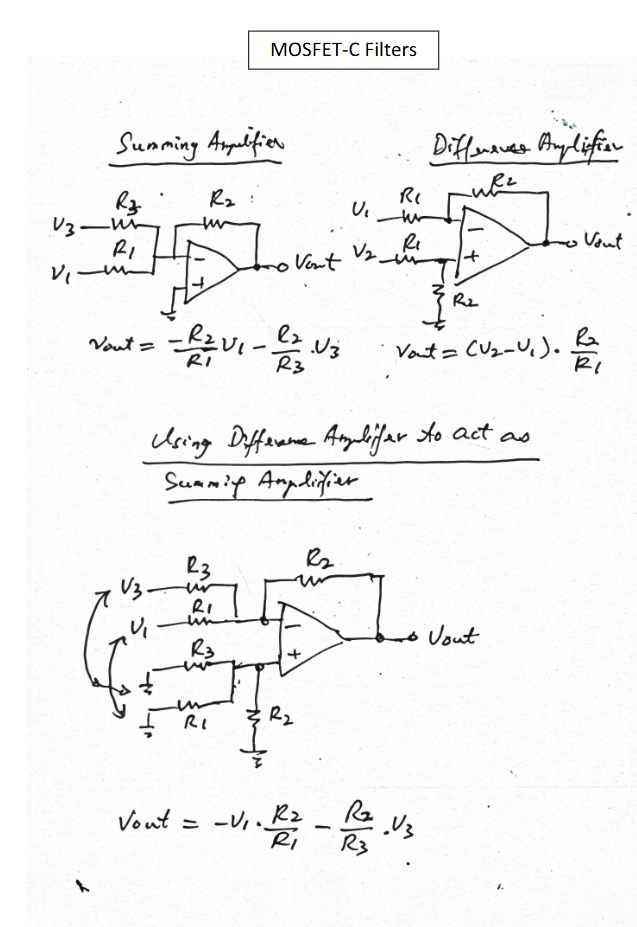

**运算放大器拓扑的演进**

### 1. 常规加法器与减法器 (Top half)

- **Summing Amplifier (加法放大器)**：信号 $V_1, V_3$ 都加在负极。输出 $V_{out}$ 是 $V_1$ 和 $V_3$ 的反相加权和。**痛点：正极是直接接地的，缺乏对称性，无法直接应用上一页推导的差分抵消。**
- **Difference Amplifier (差分放大器)**：信号 $V_1$ 进负极，$V_2$ 进正极。经典的四电阻结构。

### 2. Using Difference Amplifier to act as Summing Amplifier

老师的目的是：**我既想要实现信号的相加（滤波器的系统架构决定的），又想要拥有差分放大器那种完全对称的阻抗网络（为了适配 MOSFET 的线性化需求）。**

怎么做？看老师画的那个带大量箭头的图：

1. 首先，搭建一个标准的差分放大器拓扑（上下都有反馈网络）。

2. 然后，在运放的**负输入端**，接入我们要处理的真实信号 $V_1$ 和 $V_3$（分别通过 $R_1$ 和 $R_3$）。同时有一个反馈电阻 $R_2$ 连到输出。

3. 仔细看运放的**正输入端**下方的三个电阻。

   - 接地的电阻 $R_1$。

   - 接地的电阻 $R_3$。

   - 接地的电阻 $R_2$。

     这三个电阻的阻值，与负极上方的网络**一模一样**！只是它们的另一端没有接信号，而是全部**接地（Ground）**。

### 3. 为什么一定要加这组“接地”的电阻网络？

老师在最后给出了输出公式：

$$V_{out} = -V_1 \frac{R_2}{R_1} - V_3 \frac{R_2}{R_3}$$

你会发现，这个公式和最上面的基础 Summing Amplifier **一模一样**！

既然宏观上的传递函数没变，为什么要浪费面积在正极下面加上一堆接地的电阻？

只有在这样的拓扑下，当你把这些物理电阻 $R_1, R_2, R_3$ 全部替换成成对的 MOSFET 时，运放才能通过完美的差分放大特性，强迫内部的节点电压（比如 $V_x$）在正负两端发生联动，从而把 MOSFET 产生的偶次非线性失真电流，在运放内部**完美相减、彻底抵消**。

---

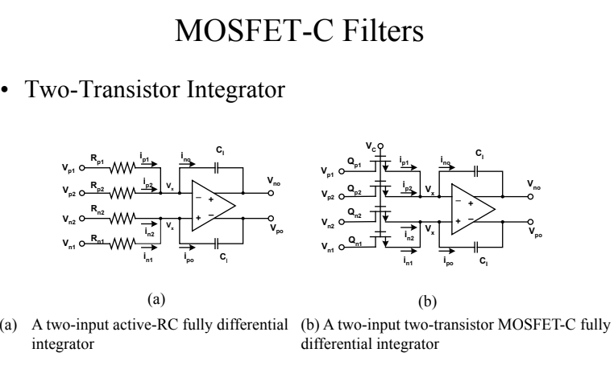

当一个 MOSFET 工作在线性区（深三极管区，即 $V_{DS}$ 较小）时，它的漏极电流 $I_D$ 公式为：

$$I_D = \mu_n C_{ox} \frac{W}{L} \left[ (V_{GS} - V_{th})V_{DS} - \frac{1}{2}V_{DS}^2 \right]$$

假设晶体管的源极（Source）连接到运算放大器的输入端，电压为 $V_x$；漏极（Drain）连接到输入信号，电压为 $V_{in}$；栅极（Gate）控制电压为 $V_c$。那么：

- $V_{GS} = V_c - V_x$
- $V_{DS} = V_{in} - V_x$

代入公式展开：

$$I_D = \mu_n C_{ox} \frac{W}{L} \left[ (V_c - V_x - V_{th})(V_{in} - V_x) - \mathbf{\frac{1}{2}(V_{in} - V_x)^2} \right]$$

### 1. 电路拓扑解析 

- **图 (a)** 是传统的全差分有源 RC 积分器（Active-RC fully differential integrator）。输入是两对差分信号：$(V_{p1}, V_{n1})$ 和 $(V_{p2}, V_{n2})$，通过真实的物理电阻 $R$ 输入到运放中。
- **图 (b)** 是第一步进化：**双晶体管 MOSFET-C 积分器**。我们将所有的物理电阻替换为 N 沟道 MOSFET（$Q_{p1}, Q_{p2}, Q_{n1}, Q_{n2}$）。它们的栅极全部接同一个控制电压 $V_c$。

### 2. 数学推导与破绽 

首先，在运放的负输入端（电压为 $V_x$），根据基尔霍夫电流定律 (KCL)，流入运放的电流 $i_{no}$ 等于两个分支电流之和：

$$i_{no} = i_{p1} + i_{p2} = \frac{v_{p1} - V_x}{R_{p1}} + \frac{v_{p2} - V_x}{R_{p2}}$$

同理，正输入端的电流：

$$i_{po} = i_{n1} + i_{n2} = \frac{v_{n1} - V_x}{R_{n1}} + \frac{v_{n2} - V_x}{R_{n2}}$$

经过电容 $C_I$ 积分后，输出电压 $v_{po}$ 和 $v_{no}$ 为：

$$v_{po} = V_x - \frac{i_{po}}{sC_I}, \quad v_{no} = V_x - \frac{i_{no}}{sC_I}$$

相减得到差分输出电压 $V_{diff}$：

$$V_{diff} = v_{po} - v_{no} = \frac{i_{no} - i_{po}}{sC_I}$$

假设电路完全对称，即四根“管子”的尺寸一模一样，那么它们的等效电阻 $R_i$ 也是一样的，此时：

$$V_{diff} = \frac{1}{s R_1 C_I}(v_{p1} - v_{n1}) + \frac{1}{s R_2 C_I}(v_{p2} - v_{n2})$$

$$R_i = \frac{1}{\mu_n C_{ox} \left(\frac{W}{L}\right)_i (\mathbf{V_c - V_x} - V_{tn})}$$

你发现问题了吗？等效电阻 $R_i$ 的分母里包含了 $\mathbf{V_x}$！

$V_x$ 是运放输入端的共模电压。在理想运放中，$V_x$ 应该是交流地（0V）。但在实际的大信号摆幅下，运放的虚地并不完美，而且如果输入包含共模信号，$V_x$ 是会随信号波动的。

**结论：** 这种双晶体管结构虽然利用差分相减抵消了一部分偶次谐波，但它的等效电阻**仍然受到节点电压 $V_x$ 的调制**，导致严重的偶次非线性和失真。**它不够完美**

---

 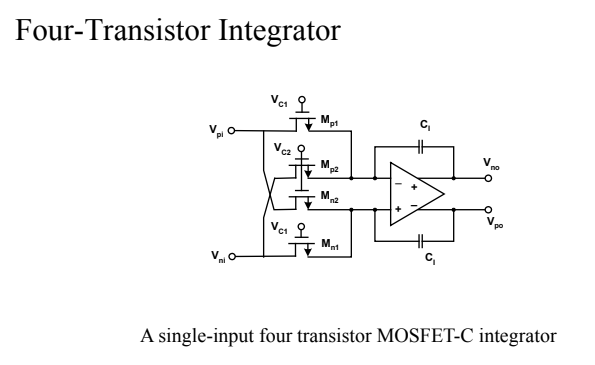

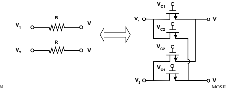

为了彻底杀死非线性，希腊微电子大师 Yannis Tsividis 发明了著名的“四晶体管交叉耦合结构”（Cross-coupled quad）。

### 1. 结构大换血：巧妙的交叉连接 

现在，对于单一差分输入对 $(V_{pi}, V_{ni})$，我们不只是用两个管子，而是用了**四个管子**（$M_{p1}, M_{p2}, M_{n1}, M_{n2}$）。

仔细观察它的连线，非常像“立交桥”：

- 输入 $V_{pi}$ 同时连接到上方管子 $M_{p1}$ 和下方管子 $M_{n2}$。
- 输入 $V_{ni}$ 同时连接到上方管子 $M_{n1}$ 和下方管子 $M_{p2}$。
- 栅极控制也分化了：$M_{p1}, M_{n1}$ 连到控制电压 $\mathbf{V_{c1}}$；$M_{p2}, M_{n2}$ 连到控制电压 $\mathbf{V_{c2}}$。

为什么要搞得这么复杂？**为了数学上的完美相消。**

### 2. 完全推导过程

我们回到前面写的 MOSFET 真实电流公式：

$$I = K \left[ (V_c - V_x - V_{th})(V_{in} - V_x) - \frac{1}{2}(V_{in} - V_x)^2 \right]$$

*(其中 $K = \mu_n C_{ox} \frac{W}{L}$)*

现在，我们计算流入运放**负输入端**的总电流 $i_{no}$（它由 $M_{p1}$ 和 $M_{p2}$ 贡献）：

- $M_{p1}$ 的电流：输入是 $V_{pi}$，栅极是 $V_{c1}$。

  $$i_{Mp1} = K \left[ (V_{c1} - V_x - V_{th})(V_{pi} - V_x) - \frac{1}{2}(V_{pi} - V_x)^2 \right]$$

- $M_{p2}$ 的电流：输入是 $V_{ni}$，栅极是 $V_{c2}$。

  $$i_{Mp2} = K \left[ (V_{c2} - V_x - V_{th})(V_{ni} - V_x) - \frac{1}{2}(V_{ni} - V_x)^2 \right]$$

- 负端总电流：$i_{no} = i_{Mp1} + i_{Mp2}$

同理，流入运放**正输入端**的总电流 $i_{po}$（由 $M_{n2}$ 和 $M_{n1}$ 贡献）：

- $M_{n2}$ 的电流：输入是 $V_{pi}$，栅极是 $V_{c2}$。

  $$i_{Mn2} = K \left[ (V_{c2} - V_x - V_{th})(V_{pi} - V_x) - \frac{1}{2}(V_{pi} - V_x)^2 \right]$$

- $M_{n1}$ 的电流：输入是 $V_{ni}$，栅极是 $V_{c1}$。

  $$i_{Mn1} = K \left[ (V_{c1} - V_x - V_{th})(V_{ni} - V_x) - \frac{1}{2}(V_{ni} - V_x)^2 \right]$$

- 正端总电流：$i_{po} = i_{Mn2} + i_{Mn1}$

运放产生差分输出取决于**差分电流**：$\Delta i = i_{no} - i_{po}$

我们将上面四项重组，把具有相同输入电压的项放在一起减：

$$\Delta i = (i_{Mp1} - i_{Mn2}) + (i_{Mp2} - i_{Mn1})$$

**最爽的时刻来了，观察第一组括号 $(i_{Mp1} - i_{Mn2})$：**

这两个管子输入端都是 $V_{pi}$，唯一的区别是栅极电压一个是 $V_{c1}$，一个是 $V_{c2}$。

当它们相减时：

$$i_{Mp1} - i_{Mn2} = K \left[ (V_{c1} - V_x - V_{th})(V_{pi} - V_x) \right] - K \left[ (V_{c2} - V_x - V_{th})(V_{pi} - V_x) \right]$$

**注意！讨厌的平方项 $-\frac{1}{2}(V_{pi} - V_x)^2$ 被完美减掉了！**

提取公因式：

$$i_{Mp1} - i_{Mn2} = K(V_{pi} - V_x) [ (V_{c1} - V_x - V_{th}) - (V_{c2} - V_x - V_{th}) ]$$

**再注意！运放虚地共模电压 $V_x$ 和阈值电压 $V_{th}$ 也被完美减掉了！**

$$i_{Mp1} - i_{Mn2} = K(V_{pi} - V_x)(V_{c1} - V_{c2})$$

用同样的逻辑算第二组括号 $(i_{Mp2} - i_{Mn1})$：

$$i_{Mp2} - i_{Mn1} = K(V_{ni} - V_x)(V_{c2} - V_{c1}) = -K(V_{ni} - V_x)(V_{c1} - V_{c2})$$

把两组加起来：

$$\Delta i = K(V_{c1} - V_{c2})[ (V_{pi} - V_x) - (V_{ni} - V_x) ]$$

$$\Delta i = K(V_{c1} - V_{c2})(V_{pi} - V_{ni})$$

你可以看到，差分电流 $\Delta i$ 和差分输入 $(V_{pi} - V_{ni})$ 之间呈现出**绝对完美的线性关系**。没有任何平方项，也不受任何共模电压 $V_x$ 的影响。

它对应的**等效差模电阻 R_eq**：

$$R_{eq} = \frac{1}{\mu_n C_{ox} \frac{W}{L} (\mathbf{V_{c1} - V_{c2}})}$$

------

## Design of Automatic Tuning Circuit

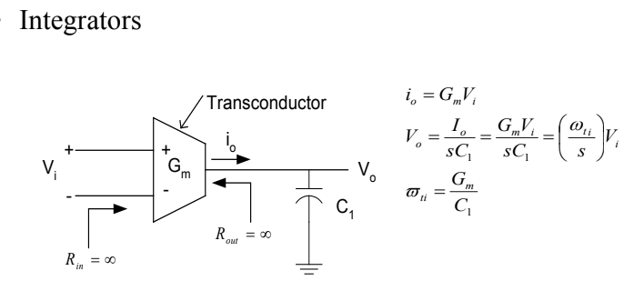

**跨导放大器 (Transconductor, $G_m$)：** 这是一个压控电流源 (VCCS)。它的作用是将输入的电压差 $V_i$ 线性地转换为输出电流 $i_o$。公式：$i_o = G_m \cdot V_i$。在 CMOS 工艺中，这通常由一个差分对（如差分源极耦合对）实现。

**What transconductance is needed for unity gain freq. of 20 MHz and 2 pF integrating capacitor?**

已知 $f_t = 20\text{ MHz}$， $C_1 = 2\text{ pF}$。
求 $G_m = \omega_{ti} \cdot C_1 = 2\pi \cdot f_t \cdot C_1 = 2\pi \times 20\times 10^6 \times 2\times 10^{-12} = 0.251\text{ mA/V}$。

---

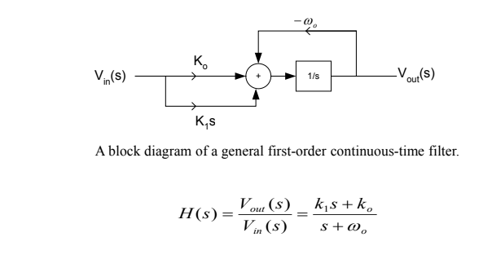

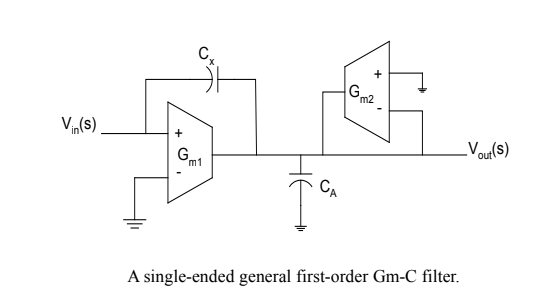

在 $V_{out}$ 节点列基尔霍夫电流定律（KCL）

- **注入节点的电流 = 流出节点的电流**

  - 注入：$G_{m1} V_{in}$ (来自前馈 Gm) $+ s C_x (V_{in} - V_{out})$ (来自前馈电容)
  - 流出：$s C_A V_{out}$ (充入接地电容) $+ G_{m2} V_{out}$ (被反馈 Gm 抽走)

- **整理合并：**

  $$G_{m1} V_{in} + s C_x V_{in} - s C_x V_{out} = s C_A V_{out} + G_{m2} V_{out}$$

  $$(s C_x + G_{m1}) V_{in} = [s(C_A + C_x) + G_{m2}] V_{out}$$

- **得到传递函数：**

  $$\frac{V_{out}(s)}{V_{in}(s)} = \frac{s C_x + G_{m1}}{s(C_A + C_x) + G_{m2}}$$

为了将其化为标准形式 $\frac{k_1 s + k_o}{s + \omega_o}$，我们将分子分母同除以总电容 $(C_A + C_x)$，得到幻灯片上的核心长公式：

$$\frac{V_{out}(s)}{V_{in}(s)} = \frac{s \left(\frac{C_x}{C_A + C_x}\right) + \left(\frac{G_{m1}}{C_A + C_x}\right)}{s + \left(\frac{G_{m2}}{C_A + C_x}\right)}$$

**【参数匹配与设计公式 (Design Equations)】**

通过一一比对系数，教授得出了下方的结论。这是你作为IC设计师要用来算管子尺寸的公式：

1. **极点频率：** $\omega_o = \frac{G_{m2}}{C_A + C_x} \implies \mathbf{G_{m2} = \omega_o(C_A + C_x)}$
2. **直流增益系数：** $k_o = \frac{G_{m1}}{C_A + C_x} \implies \mathbf{G_{m1} = k_o(C_A + C_x)}$
3. **高频增益系数（零点控制）：** $k_1 = \frac{C_x}{C_A + C_x}$
   - 通过代数变换，解出 $C_x$ 得到：$\mathbf{C_x = C_A \left( \frac{k_1}{1 - k_1} \right)}$
   - *深度细节：* 注意条件 $0 \le k_1 < 1$。因为 $C_x$ 必须是一个正的物理电容，所以高频增益 $k_1$ 绝对不能大于等于 1。这也是这种无源前馈架构的物理极限——它做不出高频增益大于 1 的滤波器。

**【广度延展：穷尽滤波器的可能性】**

有了这个通用公式，你可以随时“变身”：

- **做低通滤波器 (LPF)：** 令 $C_x = 0$ (不画那根线)，则 $k_1 = 0$。公式变成 $\frac{k_o}{s + \omega_o}$。
- **做高通滤波器 (HPF)：** 令 $G_{m1} = 0$ (拿掉前馈Gm)，且要求 $k_o = 0$。公式变成 $\frac{k_1 s}{s + \omega_o}$。
- **做全通滤波器 (All-Pass)：** 如果你能巧妙地利用差分电路的极性反转，使得分子变成 $(s - \omega_o)$，它就成了一个只改变相位、不改变幅度的相位均衡器。

---

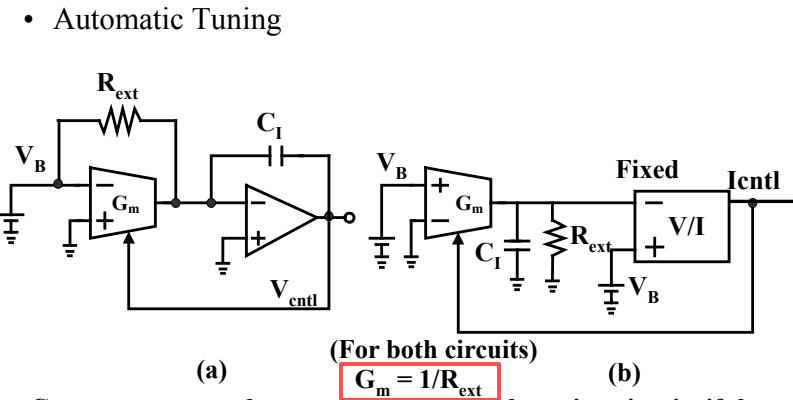

**开关电容**

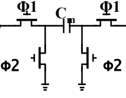

上面四个 MOS 管开关（分别由不重叠时钟 $\Phi 1, \Phi 2$ 控制）和一个居中的电容 $C_m$ 组成的网络可以等效为电阻 $$R_{eq} = \frac{1}{f_{clk} \cdot C_m}$$

> $f_{clk}$为时钟频率 

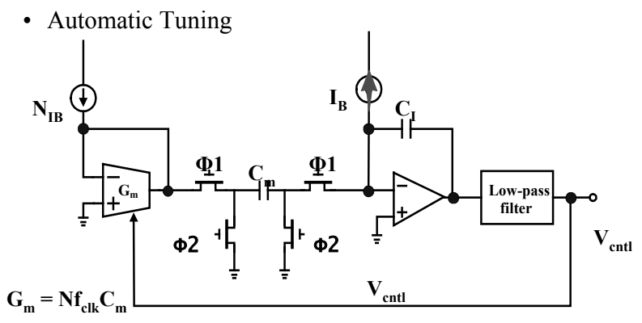

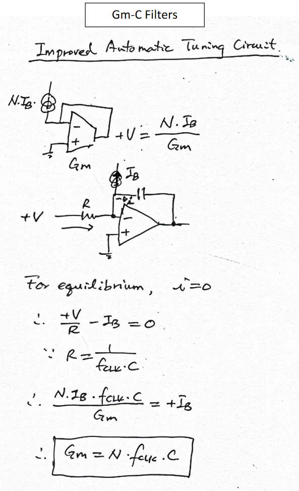

### 电路拓扑降维解析

笔记上的草图虽然简陋，但精准抓住了两个核心支路：

- **上半部分：跨导电压转换单元**

  - 一个被接成负反馈（输出接负输入）的跨导器 $G_m$。

  - 一个大小为 $N \cdot I_B$ 的直流电流源向其灌入电流。

  - 根据欧姆定律的跨导形式（$V = I / G_m$），该节点产生的直流电压为：

    $$+V = \frac{N \cdot I_B}{G_m}$$

  - *注：这对应 Slide 4 左侧那个带有偏置电流 $N_{IB}$ 的跨导器。*

- **下半部分：稳态积分平衡单元（核心所在）**

  - 这是一个带有电容反馈的运算放大器（实质是一个积分器/误差放大器）。
  - 运放的正输入端接地，所以负输入端是**“虚地 (Virtual Ground)”**（电压为 0V）。
  - 有两条路径向这个“虚地”节点注入或抽取电流：
    1. 刚刚产生的电压 $+V$，通过等效电阻 $R$（实际上是那个开关电容网络）流入节点，电流大小为 $i_R = \frac{+V}{R}$。
    2. 一个大小为 $I_B$ 的恒流源从该节点抽出电流。

### 稳态平衡推导 (For equilibrium)

教授写下的 `For equilibrium, i = 0` 是整个闭环控制系统的灵魂。

- **透明的思考过程：** 这里的 `i` 指的是流入反馈积分电容的瞬态/交流电流。当整个锁相/调谐环路达到**“锁定（Locked）”稳态**时，控制电压 $V_{cntl}$ 不再波动（保持纯直流）。既然输出不波动，流过反馈电容的电流必然为零（因为电容隔直流，$i = C \cdot \frac{dV}{dt}$，稳态时 $\frac{dV}{dt} = 0$）。

- **KCL 方程建立：** 既然进入电容的电流为 0，那么进入“虚地”节点的各个电流必须相互抵消（流入 = 流出）。

  $$\frac{+V}{R} - I_B = 0$$

### 见证代数奇迹的时刻

现在，我们把所有零件组装起来，进行代数替换：

1. 把上半部分得到的 $+V$ 代入平衡方程：

   $$\frac{\frac{N \cdot I_B}{G_m}}{R} = I_B \implies \frac{N \cdot I_B}{G_m \cdot R} = I_B$$

2. **神奇的抵消（极具工程意义的一步）：** 等式两边的绝对电流值 $I_B$ 被约掉了！

   $$\frac{N}{G_m \cdot R} = 1 \implies G_m = \frac{N}{R}$$

   *深度提示：为什么 $I_B$ 约掉很重要？这意味着我们**根本不需要在芯片里制造一个绝对精准的电流源**。在集成电路中，制造精确比值（$N:1$）的电流镜极其容易（匹配度极高），但制造绝对精准的电流极难。这个抵消证明了系统的鲁棒性。*

3. 代入开关电容的等效电阻公式 $R = \frac{1}{f_{clk} \cdot C}$：

   $$G_m = \frac{N}{\frac{1}{f_{clk} \cdot C}}$$

4. **得出终极结论：**

   $$G_m = N \cdot f_{clk} \cdot C$$

   

   ---

## Transistor Layout Profile.
> 战略性忽视
---

# Part3 Stray-Insensitive SC Circuits

## Example1

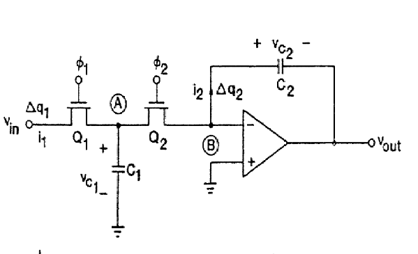

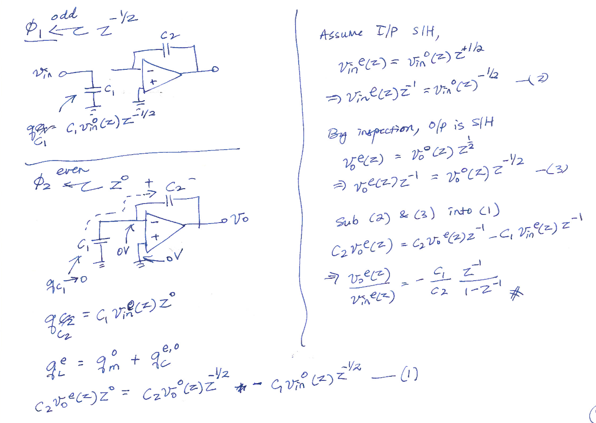

### 核心符号与时间轴约定（前置知识补充）

在深入推导前，我们需要先明确笔记中的符号命名规则和 $Z$ 域时间轴的对应关系，这是理解全图的关键：

* **时钟相位**：系统有两个非重叠时钟相位。笔记中定义 $\phi_1$ 为奇数相位（Odd phase），$\phi_2$ 为偶数相位（Even phase）。
* **上标约定**：变量上标 $o$ 代表 Odd（在 $\phi_1$ 结束时的状态），上标 $e$ 代表 Even（在 $\phi_2$ 结束时的状态）。
* **$Z$ 域延迟**：
    * $z^{-1}$ 表示延迟一个完整的时钟周期（Full cycle delay）。
    * $z^{-1/2}$ 表示延迟半个时钟周期（Half cycle delay）。
    * 我们假设当前观察的时间点是**偶数相位的结尾**，即 $n$ 时刻（对应 $z^0$）。那么紧挨着它的**上一个奇数相位的结尾**就是 $n-1/2$ 时刻（对应 $z^{-1/2}$），而**上一个偶数相位的结尾**就是 $n-1$ 时刻（对应 $z^{-1}$）。

---

### 第一步：拆解时钟相位，建立电荷守恒方程（对应笔记左半部分）

笔记的左侧分别画出了在 $\phi_1$ 和 $\phi_2$ 两个相位下的等效电路图，目的是追踪核心电容 $C_1$ 和 $C_2$ 上的电荷转移过程。

#### 1. 奇数相位 $\phi_1$ (Odd phase, 对应过去状态 $z^{-1/2}$)
* **电路动作**：开关 $Q_1$ 闭合，$Q_2$ 断开。输入电压 $v_{in}$ 对采样电容 $C_1$ 进行充电。此时运算放大器处于保持状态，$C_2$ 两端没有新的电荷注入。
* **电荷状态**：此时是前半个周期（相对于当前的 $\phi_2$），因此带有 $z^{-1/2}$ 的延迟因子。电容 $C_1$ 上存储的电荷量完全由当时的输入电压决定：
    $$q_{C_1} = C_1 \cdot v_{in}^o(z) z^{-1/2}$$
    *注：笔记中写的是 $q_{C_1}$，即在 $\phi_1$ 结束时 $C_1$ 采样到的电荷。*

#### 2. 偶数相位 $\phi_2$ (Even phase, 对应当前状态 $z^0$)
* **电路动作**：开关 $Q_1$ 断开，$Q_2$ 闭合。$C_1$ 的上极板（原本接 $v_{in}$）现在连接到了运算放大器的反相输入端。
* **物理过程深挖**：
    * 由于运放同相端接地，反相端形成**虚地（Virtual Ground, 0V）**。
    * $C_1$ 的上极板接虚地，下极板物理接地，因此 $C_1$ 两端的电压被迫变为 0V。
    * 正如笔记中所写 **“$q_{c_1} \to 0$”**，原本存储在 $C_1$ 上的电荷 $C_1 v_{in}$ 必须全部释放出去。
    * 这些电荷无处可去，只能流入运放的反馈回路，也就是被推入积分电容 $C_2$ 中。

#### 3. 建立方程 (1)：基于虚地节点的电荷守恒
笔记底部的方程 (1) 是整个推导的灵魂：
$$C_2 v_o^e(z) z^0 = C_2 v_o^o(z) z^{-1/2} - C_1 v_{in}^o(z) z^{-1/2} \quad \text{--- (1)}$$

**心路历程与公式拆解：**
根据运放反相输入端（节点 B）的电荷守恒定律：
> **当前 $C_2$ 的总电荷 = 之前 $C_2$ 保持的电荷 + 这一相新注入的电荷**

* **等号左边 $C_2 v_o^e(z) z^0$**：当前（$\phi_2$ 结束时）积分电容 $C_2$ 上的电荷量。$z^0$ 强调这是当前时刻。
* **等号右边第一项 $C_2 v_o^o(z) z^{-1/2}$**：在上一相（$\phi_1$ 结束时），$C_2$ 上原本保持的电荷量。
* **等号右边第二项 $- C_1 v_{in}^o(z) z^{-1/2}$**：这是从 $C_1$ 转移过来的电荷。
    * **为什么是负号？（极度关键）** 在 $\phi_1$ 时，$C_1$ 采样的电荷是正的，流入运放的求和节点。由于电流流入 $C_2$ 的负极板，为了维持电荷平衡，运放的输出端 $v_{out}$ 必须**向负方向下降**，以此来吸收这些电荷。这正是它被称为“反相”积分器的原因。

---

### 第二步：引入采样保持（S/H）假设，消除半周期变量（对应笔记右半部分上半区）

方程 (1) 虽然准确描述了物理过程，但它混合了偶数相位（$v_o^e$）和奇数相位（$v_o^o, v_{in}^o$）的变量。为了求出从输入到输出的完整周期传递函数，我们必须利用电路的**采样保持（Sample and Hold, S/H）特性**，将奇数相位（带 $z^{-1/2}$）的变量全部替换为整周期（带 $z^{-1}$）的变量。

#### 1. 输入端的 S/H 假设：推导方程 (2)
笔记写道："Assume I/P S/H"（假设输入信号在整个时钟周期内保持不变）。
* **物理意义**：如果输入信号 $v_{in}$ 是由前一级的采样保持电路驱动的，那么它在一个完整的时钟周期内是常数。这意味着，在当前周期的 $\phi_1$ 相位采样到的输入值，等同于上一个周期 $\phi_2$ 相位结束时的输入值。
* **时域表现**：$v_{in}(\text{odd}_{n-1/2}) = v_{in}(\text{even}_{n-1})$
* **$Z$ 域转换**：
    $$v_{in}^o(z) z^{-1/2} = v_{in}^e(z) z^{-1} \quad \text{--- (2)}$$
    （笔记中第一行推导形式是 $v_{in}^e(z) = v_{in}^o(z) z^{+1/2}$，两边同乘 $z^{-1}$ 即可得到方程 2，它的本质就是用上一周期的状态替换当前半周期的状态）。

#### 2. 输出端的 S/H 观察：推导方程 (3)
笔记写道："By inspection, O/p is S/H"（通过观察电路结构可知，输出本身就具有采样保持特性）。
* **物理意义**：观察图 1 的电路，在 $\phi_1$ 阶段，开关 $Q_2$ 断开，运放的反馈电容 $C_2$ 虽然连着，但没有任何新的电荷注入（输入端断开）。因此，运放在整个 $\phi_1$ 阶段仅仅是在**保持**它在上一相（$\phi_2$）结束时的输出电压。
* **时域表现**：$v_o(\text{odd}_{n-1/2}) = v_o(\text{even}_{n-1})$
* **$Z$ 域转换**：
    $$v_o^o(z) z^{-1/2} = v_o^e(z) z^{-1} \quad \text{--- (3)}$$
    （这说明奇数相位的输出，就是延迟了一个完整周期的偶数相位输出）。

---

### 第三步：代入求解，得出传递函数（对应笔记右下角）

万事俱备，现在我们需要做的就是纯粹的代数替换，把杂乱的半周期状态归一化。

笔记写道："Sub (2) & (3) into (1)"（将方程 2 和 3 代入方程 1）。

**详细推导步骤：**

1.  **写出原始方程 (1)：**
    $$C_2 v_o^e(z) = C_2 \left[v_o^o(z) z^{-1/2}\right] - C_1 \left[v_{in}^o(z) z^{-1/2}\right]$$
    *(注意：左边的 $z^0$ 省略不写，因为它就是 1)*

2.  **实施替换：**
    * 把 $\left[v_o^o(z) z^{-1/2}\right]$ 替换为方程 (3) 的 $v_o^e(z) z^{-1}$
    * 把 $\left[v_{in}^o(z) z^{-1/2}\right]$ 替换为方程 (2) 的 $v_{in}^e(z) z^{-1}$
    
    代入后得到：
    $$C_2 v_o^e(z) = C_2 v_o^e(z) z^{-1} - C_1 v_{in}^e(z) z^{-1}$$

3.  **合并同类项与化简：**
    将含有 $v_o^e(z)$ 的项移到等号左边：
    $$C_2 v_o^e(z) - C_2 v_o^e(z) z^{-1} = - C_1 v_{in}^e(z) z^{-1}$$
    提取公因式 $C_2 v_o^e(z)$：
    $$v_o^e(z) \cdot C_2 (1 - z^{-1}) = - v_{in}^e(z) \cdot C_1 z^{-1}$$

4.  **求得传递函数 $H(z)$：**
    将输出除以输入 $\frac{v_o^e(z)}{v_{in}^e(z)}$：
    $$\frac{v_o^e(z)}{v_{in}^e(z)} = -\frac{C_1 z^{-1}}{C_2 (1 - z^{-1})}$$
    稍微整理一下，即为笔记中最终的结论：
    $$\frac{v_o^e(z)}{v_{in}^e(z)} = -\frac{C_1}{C_2} \frac{z^{-1}}{1 - z^{-1}}$$

## Example2

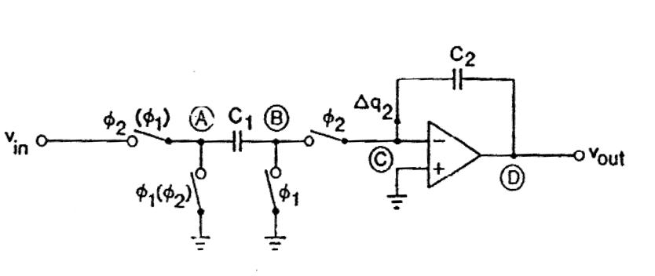

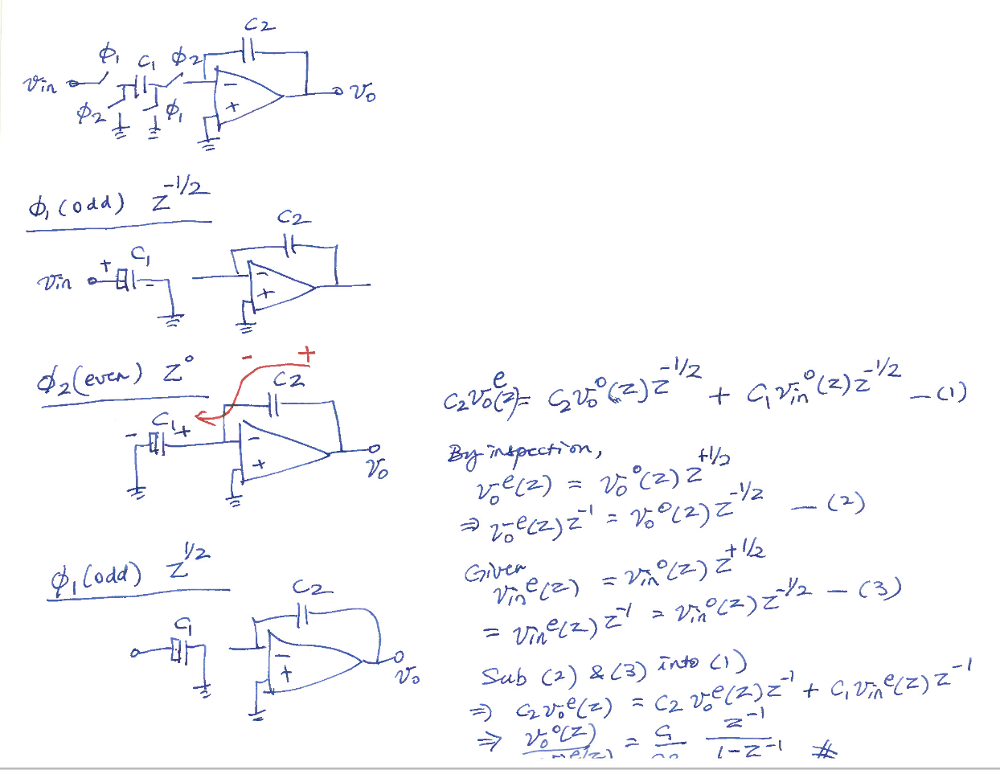

### 一、 核心概念预判与时序背景铺垫

在进入公式之前，我们必须先统一图纸中的时序语言和变量定义。开关电容电路的核心在于“离散的电荷搬移”，因此时间被切分成了不同的相位。

**1. 时钟相位定义（Clock Phases）**

图中明确标示了两个不重叠（Non-overlapping）的时钟相位：

- **$\phi_1$ (odd)**：奇数相位。这是电容 $C_1$ 进行“采样（Sampling）”的阶段。
- **$\phi_2$ (even)**：偶数相位。这是电荷发生“转移（Transfer）”和积分的阶段。

**2. Z 域延迟符号约定（Z-Domain Delays）**

- $z^{-1}$：代表一个**完整**的时钟周期延迟。
- $z^{-1/2}$：代表**半个**时钟周期的延迟（即从 $\phi_1$ 到 $\phi_2$，或者从 $\phi_2$ 到下一个 $\phi_1$ 的时间差）。
- $z^0$：代表当前时刻，无延迟。

**3. 上标定义**

- 变量上的 $o$ 上标（如 $v_o^o$）：代表该信号在 **odd ($\phi_1$)** 相位时的值。
- 变量上的 $e$ 上标（如 $v_o^e$）：代表该信号在 **even ($\phi_2$)** 相位时的值。

------

### 二、 逐阶段电路状态剖析（图解还原）

作者在笔记左侧画了三个局部电路图，这是建立电荷守恒方程的物理基础。我们来看看作者的心路历程是如何在这个过程中演进的：

#### 阶段 1：$\phi_1$ (odd) 相位 —— 采样阶段

- **电路动作**：输入开关 $\phi_1$ 闭合，将 $C_1$ 的左极板接在输入电压 $v_{in}$ 上；$C_1$ 右侧的接地开关 $\phi_1$ 闭合，将右极板接地。同时，运放输入端的 $\phi_2$ 开关断开。
- **物理结果**：$C_1$ 完全独立于运放。它被充电，此时存储的电荷量完全由当前的输入电压决定。
- **状态总结**：此阶段 $v_{in}$ 被采样到了 $C_1$ 上。此时运放处于“保持”状态，反馈电容 $C_2$ 的电荷没有变化。

#### 阶段 2：$\phi_2$ (even) 相位 —— 电荷转移阶段

- **电路动作**：$\phi_1$ 开关全部断开。$\phi_2$ 开关闭合，使得 $C_1$ 的左极板接地，$C_1$ 的右极板连接到运算放大器的反相输入端（虚地，Virtual Ground，电位为 0V）。
- **物理结果（核心心路）**：$C_1$ 的两端都被强制拉到了 0V（一端物理接地，一端虚地）。这意味着 $C_1$ 必须**清空**其在 $\phi_1$ 阶段积累的所有电荷。
- **电荷去向**：由于运放输入端阻抗无穷大，这些被挤出来的电荷无处可去，只能沿着图中**红色的箭头**方向，全部涌入反馈回路中的电容 $C_2$ 中。这就是“积分”动作的物理本质。

------

### 三、 公式推导的完整心路历程（逐行解析）

现在，我们严格按照作者在右侧写下的四组公式，重现其代数推导过程。

#### 步骤 1：建立核心的电荷守恒方程 —— 公式 (1)

笔记中的第一行公式是整个推导的灵魂：

$$C_2 v_o^e(z) = C_2 v_o^o(z) z^{-1/2} + C_1 v_{in}^o(z) z^{-1/2} \quad \text{--- (1)}$$

**【心路历程拆解】：**

这本质上是一个**状态更新方程（New State = Old State + Change）**，应用于反馈电容 $C_2$ 的电荷。

1. **等式左边 $C_2 v_o^e(z)$**：代表在当前的偶数相位 $\phi_2$ 时，$C_2$ 上最新的总电荷量（正比于最新的输出电压 $v_o^e$）。
2. **等式右边第一项 $C_2 v_o^o(z) z^{-1/2}$**：代表 $C_2$ 在**上一个半周期**（即刚刚过去的奇数相位 $\phi_1$）所保持的“旧电荷量”。$z^{-1/2}$ 这个算子非常精准地表达了“时间倒退半个周期”的物理动作。
3. **等式右边第二项 $+ C_1 v_{in}^o(z) z^{-1/2}$**：代表从 $C_1$ 转移过来的“新电荷增量”。
   - 为什么是 $v_{in}^o$ 和 $z^{-1/2}$？因为这个转移的电荷，是 $C_1$ 在**半个周期前**的奇数相位 $\phi_1$ 时采样的输入电压决定的。
   - *(注：虽然标准的无寄生反相积分器此处推导常带有负号，但我们严格遵循图纸作者的设定，作者在此处按正向电荷累加的逻辑构建了方程，即认为转移进入 $C_2$ 的电荷是正向累加的。)*

#### 步骤 2：利用“观察法”处理输出变量延迟 —— 公式 (2)

笔记写道："By inspection,"（通过观察可知）

$$v_o^e(z) = v_o^o(z) z^{+1/2}$$

$$\Rightarrow v_o^e(z) z^{-1} = v_o^o(z) z^{-1/2} \quad \text{--- (2)}$$

**【心路历程拆解】：**

1. **物理直觉**：在奇数相位 $\phi_1$ 时，运放与输入网络是断开的，$C_2$ 只是在单纯地“保持”电荷，输出电压 $v_o$ **不会发生任何改变**。
2. **时序关系**：这意味着，在任意一个奇数相位 $\phi_1$ 时，输出电压的值，完全等于它在**紧接着的下一个**偶数相位 $\phi_2$ 时的值。
3. **代数操作**：作者写下 $v_o^e(z) = v_o^o(z) z^{+1/2}$（偶数相位的值 = 奇数相位的值时间前进半个周期）。为了能够将这个关系代入公式 (1) 中，作者巧妙地在等式两边同时乘以 $z^{-1}$（延迟一个全周期），从而凑出了公式 (1) 中需要被替换的项 $v_o^o(z) z^{-1/2}$。

#### 步骤 3：处理输入信号的假设条件 —— 公式 (3)

笔记写道："Given"（已知条件 / 假设前提）

$$v_{in}^e(z) = v_{in}^o(z) z^{+1/2}$$

$$\Rightarrow v_{in}^e(z) z^{-1} = v_{in}^o(z) z^{-1/2} \quad \text{--- (3)}$$

**【心路历程拆解】：**

1. **工程假设**："Given" 这个词非常关键。它表明作者对输入信号 $v_{in}$ 做了一个工程上的常见假设——输入信号是一个**采样保持（Sample-and-Hold）信号**。
2. **物理意义**：这个假设意味着 $v_{in}$ 在奇数和偶数相位期间保持恒定不变化（即在一个完整的时钟周期内，输入信号是阶梯状平整的）。
3. **代数操作**：与公式 (2) 的思路完全一致，作者通过等式两边同乘 $z^{-1}$，构造出了 $v_{in}^o(z) z^{-1/2}$ 这个项，以便下一步的无缝代入。

#### 步骤 4：终极代数替换与化简

笔记最后一步："Sub (2) & (3) into (1)"（将公式2和3代入公式1）

**【详细推导步骤复现】：**

1. **原始方程 (1)**：

   $$C_2 v_o^e(z) = C_2 [v_o^o(z) z^{-1/2}] + C_1 [v_{in}^o(z) z^{-1/2}]$$

2. **执行代入**：将方括号内的项，分别用公式 (2) 和 (3) 的左边部分替换：

   $$C_2 v_o^e(z) = C_2 [v_o^e(z) z^{-1}] + C_1 [v_{in}^e(z) z^{-1}]$$

   *(注意看，此时方程中所有的变量上标都统一变成了 $e$，即全部统一到了偶数相位，半周期算子 $z^{-1/2}$ 也全部被消除，变成了标准的全周期延迟算子 $z^{-1}$。这是整个推导最精妙的一步。)*

3. **合并同类项**（将含有 $v_o^e(z)$ 的项移到等式左边）：

   $$C_2 v_o^e(z) - C_2 v_o^e(z) z^{-1} = C_1 v_{in}^e(z) z^{-1}$$

4. **提取公因式**：

   $$C_2 v_o^e(z) (1 - z^{-1}) = C_1 v_{in}^e(z) z^{-1}$$

5. **求解传递函数 $H(z)$**（将输出除以输入）：

   $$\Rightarrow \frac{v_o^e(z)}{v_{in}^e(z)} = \frac{C_1}{C_2} \frac{z^{-1}}{1 - z^{-1}} \quad \#$$

## Example3

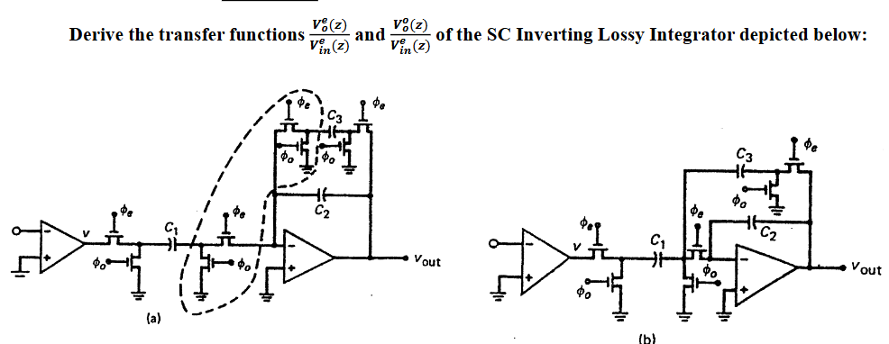

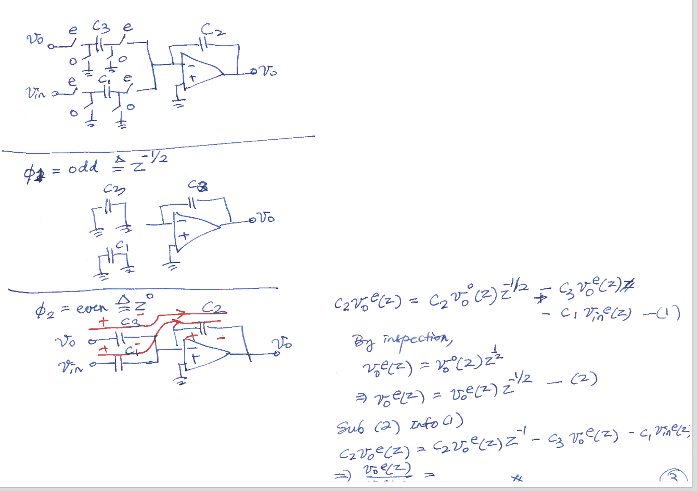

### 第一步：构建虚地节点的电荷守恒方程 —— 公式 (1)

笔记写道（注意图中 $C_3$ 前面的符号有涂改，最终确认是负号）：

$$C_2 v_o^e(z) = C_2 v_o^o(z) z^{-1/2} - C_3 v_o^e(z) - C_1 v_{in}^e(z) \quad \text{--- (1)}$$

这是一个极度优美的**状态更新方程（新状态 = 旧状态 + 增量）**。

1. **等号左边 $C_2 v_o^e(z)$**：这是在当前的 even 相位，$C_2$ 上最终稳定下来的总电荷量（代表最新的系统状态）。
2. **第一项 $C_2 v_o^o(z) z^{-1/2}$**：这是系统继承的**“旧资产”**。即半个周期前（odd相位）$C_2$ 所保持的电荷。$z^{-1/2}$ 表示时间倒退半个时钟周期。
3. **第二项 $- C_3 v_o^e(z)$**：这是反馈支路在 even 相位**“强行抽取”的电荷**。正如我们刚才分析的，$C_3$ 要充电，从虚地节点抽走了等效为 $C_3 v_o^e$ 的正电荷（反映在积分电容上就是负号）。图中画在 $C_3$ 上的红色箭头，完美诠释了电荷流向 $C_2$ 产生负面影响的过程。
4. **第三项 $- C_1 v_{in}^e(z)$**：这是前馈支路在 even 相位**“泵入”的信号电荷**。同理，它也会给虚地节点带来净负电荷的注入。

*(注：反相积分器的本质就是输入正电压，会导致输出电压下降，所以增量项都带有负号。作者在此处非常严谨地推导出了这两个负号。)*

### 第二步：利用“观察法”处理无操作相位的延迟 —— 公式 (2)

笔记写道：

> By inspection,
>
> $v_o^e(z) = v_o^o(z) z^{+1/2}$ *(此处图中作者有一个隐约的推导起点)*
>
> $\Rightarrow v_o^o(z) = v_o^e(z) z^{-1/2} \quad \text{--- (2)}$

1. **物理直觉**：回到我们在“阶段1”的分析。在 odd 相位时，运放是与外部采样电容彻底断开的。这意味着什么？意味着**整个 odd 相位期间，输出电压 $v_o$ 死如止水，绝对不会发生任何变化**。
2. **时间映射**：既然不变，那么 odd 相位结束时的电压，就100%等于它刚开始时的电压，也就是上一个 even 相位结束时的电压。
3. **Z域表达**：$v_o^o(z)$ 就是 $v_o^e(z)$ 延迟了半个周期（从上一个 even 到当前的 odd）。所以顺理成章写出 $v_o^o(z) = v_o^e(z) z^{-1/2}$。

### 第三步：完美的代数消元（Sub 2 into 1）

笔记写道：

> Sub (2) into (1)
>
> $C_2 v_o^e(z) = C_2 [v_o^e(z) z^{-1/2}] z^{-1/2} - C_3 v_o^e(z) - C_1 v_{in}^e(z)$

这一步是消除“半周期状态（$v_o^o$）”，将整个方程统一到完整的观测周期（哪怕只看 even 相位）。

将 (2) 代入 (1) 后，$z^{-1/2} \cdot z^{-1/2}$ 完美地合成了 $z^{-1}$。

$$C_2 v_o^e(z) = C_2 v_o^e(z) z^{-1} - C_3 v_o^e(z) - C_1 v_{in}^e(z)$$

这个方程的物理意义豁然开朗：**当前的电荷 = 上一个完整周期遗留的电荷 - 漏掉的电荷($C_3$) - 新输入的电荷($C_1$)**。

### 第四步：求解传递函数

1. 将所有包含 $v_o^e(z)$ 的项移到等号左边：

   $$C_2 v_o^e(z) - C_2 v_o^e(z) z^{-1} + C_3 v_o^e(z) = - C_1 v_{in}^e(z)$$

2. 提取公因式 $v_o^e(z)$：

   $$v_o^e(z) \left[ C_2 (1 - z^{-1}) + C_3 \right] = - C_1 v_{in}^e(z)$$

3. 将 $v_{in}^e(z)$ 除过去，将方括号内的项除过去，得到终极答案：

$$\frac{v_o^e(z)}{v_{in}^e(z)} = \frac{- C_1}{C_2 (1 - z^{-1}) + C_3}$$

##  什么是“有损”（Lossy）？
在普通的积分器中，反馈路径只有一个电容 $C_2$。而在这个电路中，多了一个并联的支路 $C_3$。
* **物理意义：** $C_3$ 在每个周期都会被重置（放电），它像一个“漏水”的阀门，在积分过程中不断“偷走”一部分电荷。在 $s$ 域中，它相当于给积分器加了一个极点，使其从 $\frac{1}{s}$ 变成 $\frac{1}{s+a}$。

### 极点（Pole）的位置
* **无损积分器 / 普通积分器 (Lossless / Ideal Integrator) ($C_3=0$)：** 极点在 $z=1$，位于单位圆上，代表无限累加（理想积分）。
* **有损积分器 ($C_3>0$)：** 极点在 $z = \frac{C_2}{C_2 + C_3}$。因为分母大于分子，所以极点移动到了单位圆**内部**。
* **结论：** 极点进圆意味着系统是稳定的，它不会像理想积分器那样因为微小的直流偏置而导致输出饱和。

| 特性 | 无损积分器 (C3=0) | 有损积分器 (C3>0) |
|------|------------------|--------------------|
| 能量状态 | 持续积累，无损耗。 | 边存边漏，最终平衡。 |
| 极点位置 | z=1（积分） | 0<z<1（低通） |
| 阶跃响应 | 阶梯式上升，直达无穷大。 | 阶梯式上升，收敛于有限值。 |
| 抗直流干扰 | 极差（容易因失调电压瘫痪）。 | 极好（直流增益被限制）。 |
| 实际应用 | 高精度 Σ−Δ ADC 内部积分器、某些开关电容振荡器。 | 滤波器设计（如 Biquad）、需要稳定工作点的模拟前端。 |
---

# Part3 Basic Switched Current (SI) Cells
## Example4

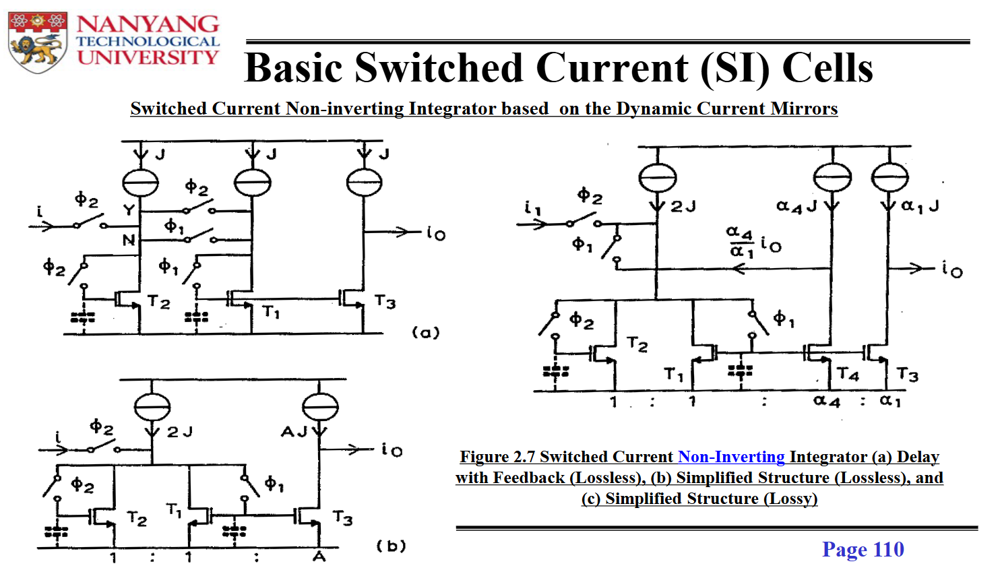

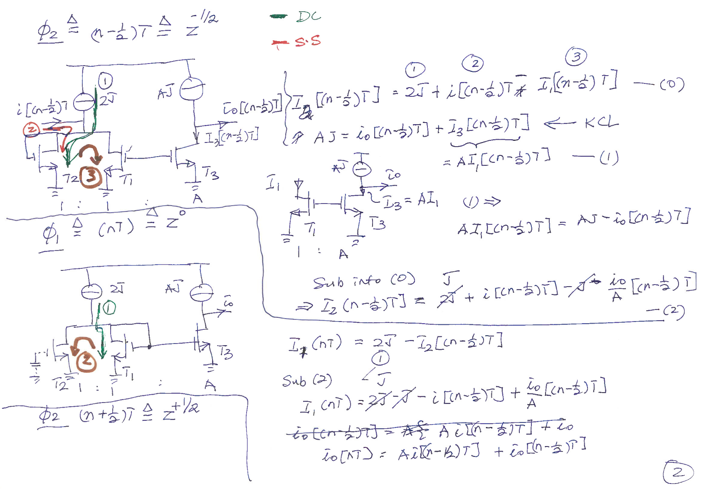

这份手写笔记和课件截图是对**开关电流（Switched-Current, 简称 SI）非反相积分器**的经典时域分析。

------

### 第一部分：破解“电流流向”——为什么是这几个箭头？

在手写笔记第一张图中（$\phi_2$ 阶段），作者画了三个关键的箭头。理解它们是看懂推导的前提。

#### 图中箭头的具体含义

- **绿色向下箭头 (1) 【DC】：** 代表来自上方电流源的直流偏置电流 $2J$ 的主要流动趋势。它源源不断地向下注入到下方的晶体管网络中。
- **红色向右箭头 (2) 【S.S (Small Signal)】：** 代表输入的交流小信号电流 $i[(n-\frac{1}{2})T]$。它在开关 $\phi_2$ 闭合时注入节点。
- **棕色回环箭头 (3)：** 这个箭头代表的是**节点基尔霍夫电流定律（KCL）的重新分配**。
  - 在开关 $\phi_2$ 闭合时，公共节点（上方黑线）汇集了来自顶部的 $2J$ 和来自左侧的 $i$。
  - 此时 $T_2$ 处于“采样（二极管连接）”状态，而 $T_1$ 处于“保持（栅极断开）”状态。
  - $T_1$ 正在**强行抽取**它在上一个半周期记住的电流 $I_1$。
  - 因此，多出来的（或者不足的）电流，必须全部由 $T_2$ 来吸收。棕色箭头生动地表示了：**总输入电流减去 $T_1$ 强行抽走的电流后，剩余的电流“流向”了 $T_2$**。

------

### 第二部分：详细数学推导过程（透明化展示）

我们按照时间顺序，分为两个半周期进行 KCL（基尔霍夫电流定律）的列写与推导。

#### 阶段一：$\phi_2 \triangleq (n-\frac{1}{2})T \triangleq z^{-1/2}$ （对应手写笔记上半部分）

**【电路状态分析】：**

- 开关 $\phi_2$ 闭合，$\phi_1$ 断开。
- **$T_2$ 的状态：** 栅极与漏极相连，处于**采样（Sampling）**模式。它正在适应当前节点的总电流。
- **$T_1$ 的状态：** 开关 $\phi_1$ 断开，栅极孤立。其 $C_{gs}$ 保持着上一个状态的电压，处于**保持（Holding）**模式。所以此时它抽取的电流 $I_1$ 是一个已知量。
- **$T_3$ 的状态：** $T_3$ 的栅极永远和 $T_1$ 连在一起，所以它和 $T_1$ 构成比例为 $1:A$ 的电流镜（图中标注了比例 1 : 1 : A）。即 $I_3 = A \cdot I_1$。

**【公式推导 - 输入节点】：**

对 $T_1$ 和 $T_2$ 上方的公共漏极节点列 KCL（流入 = 流出）：

流入电流 = 偏置源 $2J$ + 输入信号 $i[(n-\frac{1}{2})T]$

流出电流 = 晶体管 $T_2$ 吸收的电流 $I_2[(n-\frac{1}{2})T]$ + 晶体管 $T_1$ 吸收的电流 $I_1[(n-\frac{1}{2})T]$

这正是笔记中的**方程 (0)**：

$$I_2[(n-\frac{1}{2})T] + I_1[(n-\frac{1}{2})T] = 2J + i[(n-\frac{1}{2})T]$$

整理得到 $T_2$ 当前采样的电流：

$$I_2[(n-\frac{1}{2})T] = 2J + i[(n-\frac{1}{2})T] - I_1[(n-\frac{1}{2})T] \quad \text{--- (0)}$$

**【公式推导 - 输出节点】：**

对右侧 $T_3$ 上方的输出节点列 KCL：

流入电流 = 偏置源 $AJ$

流出电流 = 输出负载电流 $i_o[(n-\frac{1}{2})T]$ + 晶体管 $T_3$ 吸收的电流 $I_3[(n-\frac{1}{2})T]$

由于 $T_3$ 是 $T_1$ 放大 A 倍的镜像，所以 $I_3 = A \cdot I_1$。代入得到笔记中的**方程 (1)**：

$$AJ = i_o[(n-\frac{1}{2})T] + A \cdot I_1[(n-\frac{1}{2})T] \quad \text{--- (1)}$$

**【第一阶段信息整合】：**

我们需要把未知状态 $I_1$ 替换掉。由方程 (1) 反解出 $I_1$：

$$A \cdot I_1[(n-\frac{1}{2})T] = AJ - i_o[(n-\frac{1}{2})T]$$

$$I_1[(n-\frac{1}{2})T] = J - \frac{i_o[(n-\frac{1}{2})T]}{A}$$

将这个 $I_1$ 的表达式**代入回方程 (0)**，得到 $T_2$ 最终存下来的电流（对应笔记中的 `Sub into (0)`）：

$$I_2[(n-\frac{1}{2})T] = 2J + i[(n-\frac{1}{2})T] - \left( J - \frac{i_o[(n-\frac{1}{2})T]}{A} \right)$$

化简后，直流偏置 $2J - J$ 变成了 $J$：

$$I_2[(n-\frac{1}{2})T] = J + i[(n-\frac{1}{2})T] + \frac{i_o[(n-\frac{1}{2})T]}{A} \quad \text{--- (2)}$$

*（注：笔记里这一步手写略显潦草，把 $2J$ 和 $J$ 划掉后直接写成了 $J$，且正负号在代入时经过了变换，但最终结果等式 (2) 是完全正确的。）*

------

#### 阶段二：$\phi_1 \triangleq (nT) \triangleq z^0$ （对应手写笔记下半部分）

时间往前推进半个周期，进入相序 $\phi_1$。

**【电路状态分析】：**

- 开关 $\phi_1$ 闭合，$\phi_2$ 断开。输入信号 $i$ 被切断。
- **$T_2$ 的状态：** 栅极断开，进入**保持（Holding）**模式。它现在死死记住了阶段一存下来的电流，即 $I_2(nT) = I_2[(n-\frac{1}{2})T]$。它现在变成了一个已知的“电流源”。
- **$T_1$ 的状态：** 开关 $\phi_1$ 闭合，进入**采样（Sampling）**模式。现在轮到它来吸收节点上多余的电流了。

**【公式推导 - 输入节点】：**

再次对公共节点列 KCL（注意此时外部输入 $i$ 断开了）：

流入电流 = $2J$

流出电流 = $T_1$ 的采样电流 $I_1(nT)$ + $T_2$ 的保持电流 $I_2[(n-\frac{1}{2})T]$

所以此时 $T_1$ 采样的电流为：

$$I_1(nT) = 2J - I_2[(n-\frac{1}{2})T]$$

**【将过去的历史（方程2）代入现在】：**

把阶段一求出的方程 (2) 代入上式：

$$I_1(nT) = 2J - \left( J + i[(n-\frac{1}{2})T] + \frac{i_o[(n-\frac{1}{2})T]}{A} \right)$$

$$I_1(nT) = J - i[(n-\frac{1}{2})T] - \frac{i_o[(n-\frac{1}{2})T]}{A}$$

**【公式推导 - 输出节点】：**

在 $\phi_1$ 阶段，输出节点同样满足 KCL，且 $T_3$ 依然镜像 $T_1$：

$$i_o(nT) = AJ - I_3(nT) = AJ - A \cdot I_1(nT)$$

**【最终收网：求出输出与输入的关系】：**

将刚刚求出的 $I_1(nT)$ 代入输出公式：

$$i_o(nT) = AJ - A \cdot \left( J - i[(n-\frac{1}{2})T] - \frac{i_o[(n-\frac{1}{2})T]}{A} \right)$$

展开括号（注意负负得正）：

$$i_o(nT) = AJ - AJ + A \cdot i[(n-\frac{1}{2})T] + i_o[(n-\frac{1}{2})T]$$

常数偏置项 $AJ$ 完美抵消，只剩下交流信号和延迟项：

$$i_o(nT) = A \cdot i[(n-\frac{1}{2})T] + i_o[(n-\frac{1}{2})T]$$

这正是笔记最底部的最终结论。

如果你对等式两边进行**Z变换**（这也是笔记中写 $z^{-1/2}$ 的用意），将时间延迟 $(n-\frac{1}{2})T$ 映射为 $z^{-1/2}$，方程变为：

$$I_o(z) = z^{-1/2} I_o(z) + A \cdot z^{-1/2} I(z)$$

提取公因式就能求出传递函数 $H(z)$：

$$I_o(z) (1 - z^{-1/2}) = A \cdot z^{-1/2} I(z)$$

$$H(z) = \frac{I_o(z)}{I(z)} = \frac{A \cdot z^{-1/2}}{1 - z^{-1/2}}$$

## Example5 无T4时：无损积分器（Lossless Integrator）

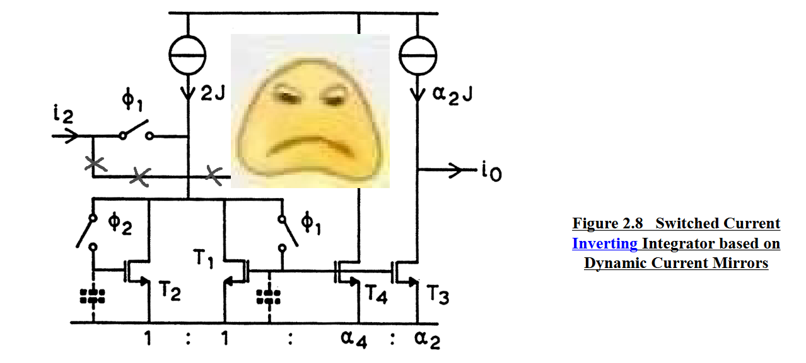

| 图解 | 题解 |
|---|---|
| 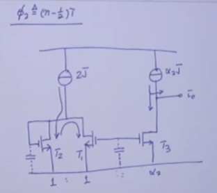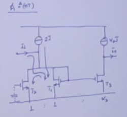 | 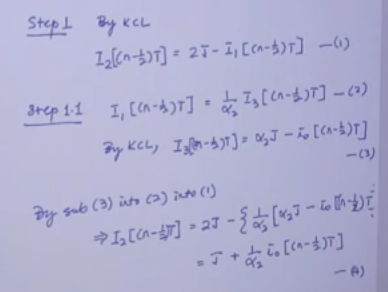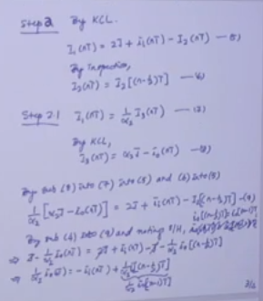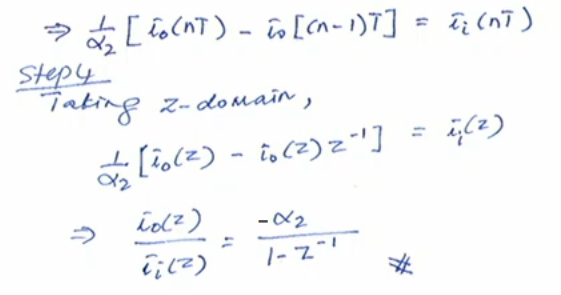 |

### 理解符号与物理意义

在开始推导前，我们需要明确几个核心符号的物理意义：

- **$2J, \alpha_2 J$**：直流偏置电流源，用于保证 MOS 管永远处于饱和区（有正电流流过）。
- **$I_1, I_2, I_3$**：流过晶体管 $T_1, T_2, T_3$ 的**总电流**（包含直流偏置 + 交流信号）。
- **$i_i, i_o$**：纯粹的交流**小信号**（Input & Output）。
- **$\alpha_2$**：$T_3$ 相对于 $T_1$ 的电流镜放大比例（宽度比 W/L）。

------

### Step 1: 锁定历史状态 —— $\phi_2 \triangleq (n-\frac{1}{2})T$ 时刻

在这个半周期，开关 $\phi_2$ 闭合。输入信号被切断。$T_2$ 的栅极和漏极短接（二极管连接），处于“采样（吸收）”状态；而 $T_1$ 孤立，维持着上一周期的电压，处于“保持”状态。我们要算出 $T_2$ 究竟存了多少电流。

**1. 输入节点 KCL（基尔霍夫电流定律）：**

- **流入**节点的电流只有上方的直流源 $2J$。

- **流出**节点的电流被 $T_1$ 和 $T_2$ 分摊。

  因此得到方程 (1)：

  $$I_2[(n-\frac{1}{2})T] = 2J - I_1[(n-\frac{1}{2})T] \quad \text{--- (1)}$$

**2. 关联输出端（Step 1.1）：**

此时 $T_3$ 依然在忠实地镜像 $T_1$ 的电流，比例为 $\alpha_2 : 1$。

$$I_1[(n-\frac{1}{2})T] = \frac{1}{\alpha_2} I_3[(n-\frac{1}{2})T] \quad \text{--- (2)}$$

同时对输出节点列 KCL，流入等于流出：

$$I_3[(n-\frac{1}{2})T] = \alpha_2 J - i_o[(n-\frac{1}{2})T] \quad \text{--- (3)}$$

**3. 代入消元（求得 $T_2$ 的记忆值）：**

我们将 (3) 代入 (2)，再将结果代入 (1)：

$$I_2[(n-\frac{1}{2})T] = 2J - \left\{ \frac{1}{\alpha_2} \left[ \alpha_2 J - i_o[(n-\frac{1}{2})T] \right] \right\}$$

展开大括号（注意负负得正）：

$$I_2[(n-\frac{1}{2})T] = 2J - J + \frac{1}{\alpha_2} i_o[(n-\frac{1}{2})T]$$

最终得到方程 (4)，这代表了 $T_2$ 在这个阶段死死记住的电流值：

$$I_2[(n-\frac{1}{2})T] = J + \frac{1}{\alpha_2} i_o[(n-\frac{1}{2})T] \quad \text{--- (4)}$$

------

### Step 2: 演绎当前状态 —— $\phi_1 \triangleq (nT)$ 时刻

时间推进半个周期。开关 $\phi_1$ 闭合。$T_2$ 断开栅极，变成了一个死守着方程 (4) 结果的恒流源。此时，**外部输入信号 $i_i(nT)$ 涌入**。$T_1$ 变成二极管连接，开始采样吸收节点上多余的电流。

**1. 输入节点 KCL：**

- **流入**电流为偏置 $2J$ 加上输入信号 $i_i(nT)$。

- **流出**电流依然是 $I_1$ 和 $I_2$。

  列出方程 (5)：

  $$I_1(nT) = 2J + i_i(nT) - I_2(nT) \quad \text{--- (5)}$$

**2. 引入历史记忆：**

通过观察（By Inspection），$T_2$ 处于保持状态，其电流等于半个周期前的值：

$$I_2(nT) = I_2[(n-\frac{1}{2})T] \quad \text{--- (6)}$$

**3. 再次关联输出（Step 2.1）：**

和之前一样，$T_3$ 镜像 $T_1$，输出节点 KCL 依然成立：

$$I_1(nT) = \frac{1}{\alpha_2} I_3(nT) \quad \text{--- (7)}$$

$$I_3(nT) = \alpha_2 J - i_o(nT) \quad \text{--- (8)}$$

**4. 终极代入与对消：**

首先，把 (8) 代入 (7)，得到当前时刻 $I_1$ 与输出的关系，我们称之为左半边：

$$\text{左半边} = \frac{1}{\alpha_2} \left[ \alpha_2 J - i_o(nT) \right] \quad \text{--- (这是方程 9 的左边)}$$

然后，把 (6) 代入 (5)，得到当前时刻 $I_1$ 与输入和历史的关系，这是右半边：

$$\text{右半边} = 2J + i_i(nT) - I_2[(n-\frac{1}{2})T]$$

将左右半边划等号，得到笔记中的长等式 (9)：

$$\frac{1}{\alpha_2} \left[ \alpha_2 J - i_o(nT) \right] = 2J + i_i(nT) - I_2[(n-\frac{1}{2})T] \quad \text{--- (9)}$$

现在，把我们在 Step 1 辛苦求得的方程 (4) 塞进等式 (9) 的右边：

$$J - \frac{1}{\alpha_2} i_o(nT) = 2J + i_i(nT) - \left( J + \frac{1}{\alpha_2} i_o[(n-\frac{1}{2})T] \right)$$

拆开括号：

$$J - \frac{1}{\alpha_2} i_o(nT) = 2J - J + i_i(nT) - \frac{1}{\alpha_2} i_o[(n-\frac{1}{2})T]$$

$$J - \frac{1}{\alpha_2} i_o(nT) = J + i_i(nT) - \frac{1}{\alpha_2} i_o[(n-\frac{1}{2})T]$$

**等号两边的直流偏置项 $J$ 完美抵消！**

$$-\frac{1}{\alpha_2} i_o(nT) = i_i(nT) - \frac{1}{\alpha_2} i_o[(n-\frac{1}{2})T]$$

稍微移项整理，将包含 $i_o$ 的项放在一起，得到时域差分方程：

$$\frac{1}{\alpha_2} i_o(nT) - \frac{1}{\alpha_2} i_o[(n-\frac{1}{2})T] = -i_i(nT)$$

------

### Step 3: 处理采样保持效应 (S/H)

等式中存在一个半周期延迟的输出项 $i_o[(n-\frac{1}{2})T]$。在 SI 电路中，$\phi_2$ 阶段 $T_1$ 的栅极是断开的，它死死维持着上一拍 $\phi_1$ 阶段结束时的电压。因此，在整个 $\phi_2$ 期间，输出电流是不变的。

由物理特性可知（笔记标注 `noting S/H`）：

$$i_o[(n-\frac{1}{2})T] = i_o[(n-1)T]$$

把这个关系代入刚才的等式，提取公因式 $\frac{1}{\alpha_2}$：

$$\frac{1}{\alpha_2} \left[ i_o(nT) - i_o[(n-1)T] \right] = -i_i(nT)$$

------

### Step 4: Z 域变换求解传递函数

我们已经拿到了完美的离散时间时域差分方程，最后一步就是跨入 Z 域，用数学上帝视角审视这个系统。

对等式两边进行 Z 变换。当前时刻 $nT$ 对应 $z^0$（即 1），延迟一个完整周期 $(n-1)T$ 对应 $z^{-1}$：

$$\frac{1}{\alpha_2} \left[ I_o(z) - I_o(z)z^{-1} \right] = -I_i(z)$$

提取出 $I_o(z)$：

$$\frac{1}{\alpha_2} I_o(z) \left( 1 - z^{-1} \right) = -I_i(z)$$

整理得到最终的传递函数：

$$\frac{I_o(z)}{I_i(z)} = \frac{-\alpha_2}{1 - z^{-1}}$$

---

## Example6 有T4时：有损积分器（Lossy Integrator）
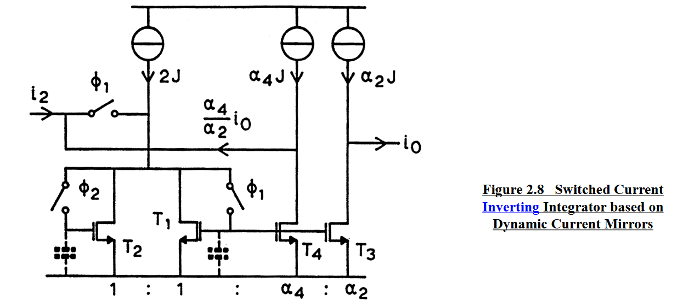

**仔细观察图 2.8 中 $T_4$ 所在的反馈支路：** $T_4$ 的漏极并没有直接连到核心节点（$T_1$ 和 $T_2$ 的公共端），而是连到了输入信号 $i_2$ 的线上，**位于开关 $\phi_1$ 的外侧！**

这意味着：**$T_4$ 的反馈电流，仅仅在 $\phi_1$ 闭合的那个半周期才会被注入系统。在 $\phi_2$ 阶段，它是被隔离的！**

带着这个极其关键的“物理外挂”，我们正式开始 4 步推导。

------

### Step 1：锁定历史状态 —— $\phi_2 \triangleq (n-\frac{1}{2})T$ 时刻

**【电路拓扑重构】**

- 开关 $\phi_2$ 闭合，$T_2$ 处于“采样”状态（二极管连接）。
- 开关 $\phi_1$ **断开**。输入信号 $i_2$ 被切断，**$T_4$ 的反馈支路也被切断**。
- $T_1$ 处于“保持”状态，其电流 $I_{T1}[(n-\frac{1}{2})T]$ 为定值。

**【KCL 推导】**

此时的核心输入节点非常干净，和无损积分器完全一样：

$$\text{流入} = 2J$$

$$\text{流出} = I_{T1}[(n-\frac{1}{2})T] + I_{T2}[(n-\frac{1}{2})T]$$

由此得到 $T_2$ 采样的电流：

$$I_{T2}[(n-\frac{1}{2})T] = 2J - I_{T1}[(n-\frac{1}{2})T] \quad \text{--- (式 A)}$$

**【Step 1.1 关联输出】**

此时 $T_3$ 正在镜像 $T_1$ 的电流（比例 $\alpha_2 : 1$）：

$$i_o[(n-\frac{1}{2})T] = \alpha_2 J - \alpha_2 I_{T1}[(n-\frac{1}{2})T]$$

反解出 $T_1$ 的电流：

$$I_{T1}[(n-\frac{1}{2})T] = J - \frac{i_o[(n-\frac{1}{2})T]}{\alpha_2} \quad \text{--- (式 B)}$$

把（式 B）代入（式 A），得到 $T_2$ 最终记在肚子里的电流：

$$I_{T2}[(n-\frac{1}{2})T] = 2J - \left( J - \frac{i_o[(n-\frac{1}{2})T]}{\alpha_2} \right)$$

$$I_{T2}[(n-\frac{1}{2})T] = J + \frac{i_o[(n-\frac{1}{2})T]}{\alpha_2} \quad \text{--- (最终态 1)}$$

------

### Step 2：演绎当前状态 —— $\phi_1 \triangleq (nT)$ 时刻 

**【电路拓扑重构】**

- 开关 $\phi_1$ 闭合，$T_1$ 处于“采样”状态。
- 开关 $\phi_2$ 断开，$T_2$ 处于“保持”状态，变成了一个死死咬住（最终态 1）数值的恒流源。
- **重头戏：** 外部信号 $i_2(nT)$ 涌入，同时 $T_4$ 及其上方的偏置 $\alpha_4 J$ 也一并连入了核心节点！

**【KCL 推导（引入反馈）】**

现在核心节点迎来了大混战：

- **偏置流入：** $2J$
- **外部信号流入：** $i_2(nT)$
- **$T_4$ 支路流入：** 上方有 $\alpha_4 J$ 往下灌，下方有 $T_4$ 往外抽。由于 $T_4$ 是 $T_1$ 的镜像，所以它抽取的电流 $I_{T4} = \alpha_4 I_{T1}(nT)$。因此这根反馈线总共净流入的电流是：$\alpha_4 J - \alpha_4 I_{T1}(nT)$。

将所有流入项等于流出项（$I_{T1} + I_{T2}$）：

$$2J + i_2(nT) + \alpha_4 J - \alpha_4 I_{T1}(nT) = I_{T1}(nT) + I_{T2}(nT)$$

把含有未知采样量 $I_{T1}(nT)$ 的项全部移到等式右边：

$$2J + \alpha_4 J + i_2(nT) - I_{T2}(nT) = (1 + \alpha_4) I_{T1}(nT)$$

**这就是反馈管 $T_4$ 带来的核心质变：等式右边凭空多出了一个 $(1 + \alpha_4)$ 的系数。**

**【代入历史，消灭未知数】**

把 Step 1 求出的 $T_2$ 历史电流（最终态 1）代入上式左边：

$$(1 + \alpha_4) I_{T1}(nT) = 2J + \alpha_4 J + i_2(nT) - \left( J + \frac{i_o[(n-\frac{1}{2})T]}{\alpha_2} \right)$$

整理化简常数项：

$$(1 + \alpha_4) I_{T1}(nT) = J + \alpha_4 J + i_2(nT) - \frac{i_o[(n-\frac{1}{2})T]}{\alpha_2}$$

**【Step 2.1 关联当前输出】**

在 $nT$ 时刻，输出节点依然遵循电流镜关系：

$$i_o(nT) = \alpha_2 J - \alpha_2 I_{T1}(nT) \implies I_{T1}(nT) = J - \frac{i_o(nT)}{\alpha_2}$$

把这个表达式代回刚刚那坨长长的等式中：

$$(1 + \alpha_4) \left( J - \frac{i_o(nT)}{\alpha_2} \right) = J(1 + \alpha_4) + i_2(nT) - \frac{i_o[(n-\frac{1}{2})T]}{\alpha_2}$$

展开左边：

$$J(1 + \alpha_4) - (1 + \alpha_4) \frac{i_o(nT)}{\alpha_2} = J(1 + \alpha_4) + i_2(nT) - \frac{i_o[(n-\frac{1}{2})T]}{\alpha_2}$$

**见证奇迹的时刻：等式两边的直流偏置项 $J(1 + \alpha_4)$ 完美对消！**

$$-(1 + \alpha_4) \frac{i_o(nT)}{\alpha_2} = i_2(nT) - \frac{i_o[(n-\frac{1}{2})T]}{\alpha_2}$$

为了得到干净的 $i_o(nT)$，等式两边同时乘以 $-\frac{\alpha_2}{1 + \alpha_4}$：

$$i_o(nT) = -\left( \frac{\alpha_2}{1 + \alpha_4} \right) i_2(nT) + \left( \frac{1}{1 + \alpha_4} \right) i_o[(n-\frac{1}{2})T]$$

------

### Step 3 & 4：Z 域转换与系统降维

时域方程已经推导完毕。为了让它看起来更像课件里的标准形式，我们定义一个**阻尼因子 $B$**：

$$B = \frac{1}{1 + \alpha_4}$$

由于物理尺寸 $\alpha_4 > 0$，所以必然有 **$B < 1$**。

同时定义增益系数 $A_2 = \frac{\alpha_2}{1 + \alpha_4}$。此时时域差分方程变为：

$$i_o(nT) = -A_2 \cdot i_2(nT) + B \cdot i_o[(n-\frac{1}{2})T]$$

对两边进行 Z 变换（Step 4）：

$$I_o(z) = -A_2 I_2(z) + B z^{-1/2} I_o(z)$$

移项并提取公因式：

$$I_o(z) (1 - B z^{-1/2}) = -A_2 I_2(z)$$

最终得到完美且极具工程意义的传递函数：

$$H(z) = \frac{I_o(z)}{I_2(z)} = \frac{-A_2}{1 - B z^{-1/2}}$$

# Example7 

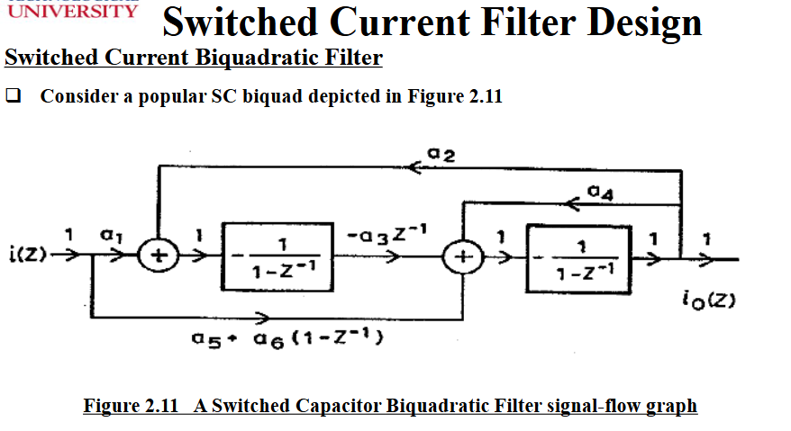

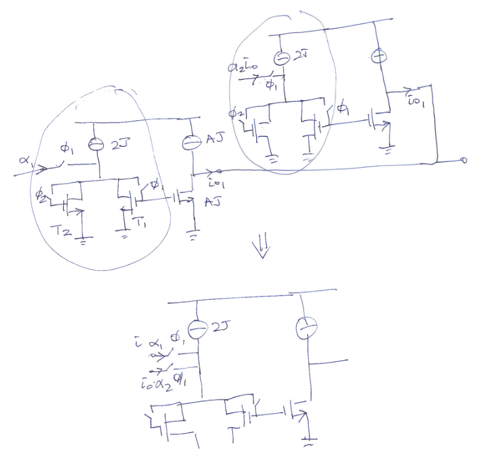

手写图向你解释的核心：**如何在硅片上极其廉价地实现图 1 中的“加法器（$\bigoplus$）”？**

具体来说，它对应了流图中的“**第一个加法器（$\bigoplus$）**”以及“**紧挨着它的第一个积分器方框 $\left[\frac{1}{1-z^{-1}}\right]$ 的输入端**”。

请把目光聚焦在图 1 信号流图最左侧的第一个加法器（$\bigoplus$）。你会发现，它需要把**外部输入信号（权重为 $\alpha_1$）**和来自后面的**反馈信号（权重为 $\alpha_2$）**加在一起，然后再送入积分器。

现在我们来看手写笔记是怎么解决这个问题的：

#### 1. 笨办法：物理堆叠（手写图上半部分）

如果我们按部就班地翻译，思路是这样的：

- **左边的圈：** 我们弄一个完整的 SI 积分器核心（带有 $T_1, T_2$ 和偏置 $2J$），专门用来接收并积分外部输入信号 $\alpha_1 i$（注意开关是 $\phi_1$）。
- **右边的圈：** 我们再弄一个一模一样的 SI 积分器核心，专门用来接收并积分反馈信号 $\alpha_2 i_o$（注意开关也是 $\phi_1$）。
- 最后，把这两路的结果在输出端强行并联。

**缺点：** 极度浪费芯片面积！你要画两套晶体管，要消耗两份 $2J$ 的直流偏置功耗。

#### 2. 利用 KCL 实现“硬件折叠”（手写图下半部分）

老师画了一个向下的双线大箭头 $\Downarrow$，意思是**“等效且简化”**。

观察上半部分，你会发现一个关键的巧合：**这两路信号（$\alpha_1 i$ 和 $\alpha_2 i_o$）都是在同一个时钟相位（$\phi_1$）被注入电路的，且它们后续要经历的“积分延迟”逻辑完全一致。**

既然如此，根据**基尔霍夫电流定律（KCL）**：在同一个节点上，流入的电流代数和等于流出的电流。电流天生具备**“并接即相加”**的物理属性。

所以，下半部分给出了终极方案：

- **裁撤冗余：** 直接砍掉右边那整套复杂的 $T_1, T_2, 2J$ 核心电路。
- **节点汇聚：** 只保留一个积分器核心。把输入信号 $\alpha_1 i$ 的开关（$\phi_1$）和反馈信号 $\alpha_2 i_o$ 的开关（$\phi_1$），**直接像接插线板一样，并联插在同一个输入节点上！**

#### 总结：手写图到底想讲什么？

手写图是在传授模拟 IC 设计中极其重要的一条经验：

**在开关电流（SI）电路中，加法操作是“免费”的。你不需要像数字电路那样去设计复杂的加法器逻辑门，也不需要像电压电路（SC）那样用运算放大器去构建加法电路。你只需要把代表不同信号的导线，在同一个时钟相位（比如都是 $\phi_1$）硬连接到同一个积分器的输入端。电子自己会遵循 KCL 定律，在流入寄生电容之前完美地完成加法运算。**

这也是为什么我们在前几个问题中看到的“通用积分器（Generalized Integrator）”会长那个样子——它预留了多个输入支路（F, B, D），就是为了方便你在拼装像 Biquad 这种复杂滤波器时，可以随心所欲地把各种前馈和反馈信号全都塞进同一个管子里进行运算，从而把芯片面积和功耗压榨到极致。
