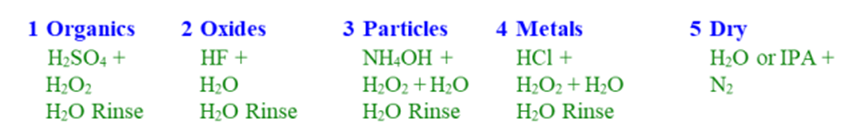
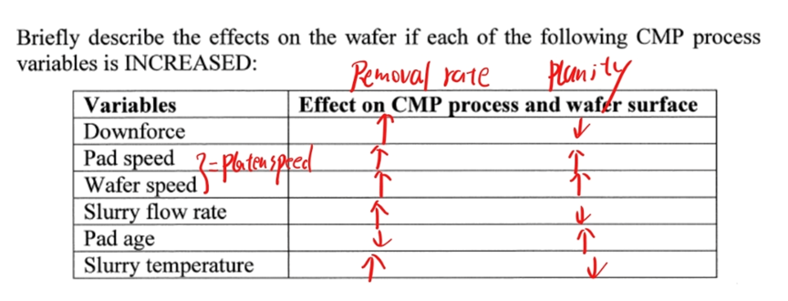
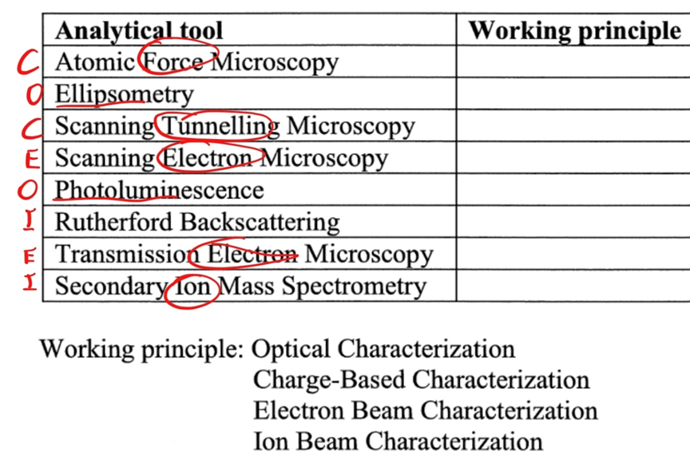
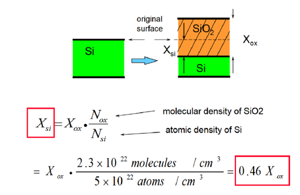

> 完整资料详见[NTU-EEE-Notes](https://github.com/zfmmmm/NTU-EEE-Notes/tree/main/src/data/blog)
## Table of contents

## Part 1
### The operating principles of the RIE system?
1.  Electrons in chamber gained energy by applied RF power.
2. When the electrode is positive, highly mobile electrons are accelerated towards the electrode, causing a significant negative charge.
3. When the bottom electrode is negative and heavy, immobile ions are accelerated towards the electrode, however, only few of these ions strike the electrode, hence, the electrode is negative biased therefore is called cathode.
4. A high electric field region is then formed around the cathode, this region is known as black space, where ions acceleration takes place before bombarding the cathode.
5. Ions are accelerated in black space before bombarding the cathode.

### The RIE mechanism?
1. **Transportation:** etchant accelerates to the substrate surface.
2. **Absorption:** etchant chemisorbs onto the substrate surface.
3. **Reaction:** reaction with the substrate and the formation of volatile by-product.
4. **Desorption:** desorption of the volatile by-product away from the substrate.

### Why does the addition of $O_2$ changes the etch rate in a $CF_4$-based plasma etch?
Oxygen is added to $CF_4$ plasma to increase the amount of reactive F species.

### Exposure steps for chemically-amplified DUV resist?
1. Resin is phenolic copolymer with protecting group that makes it insoluble in developer.
2. PAG generated acid during exposure.
3. The acid generated in exposed resist areas serves as catalyst to remove t-BOC during post exposure bake.
4. Exposed resist areas without protecting group are soluble in aqueous developer.

### What’s the purpose of HMDS?
HMDS turns the wafer from hydrophilic to hydrophobic for better adhesion.

### What happens if over-baking?
Will increase the sensitivity of UV light, destroy the PAC and reduce the solubility of the photoresist.

### What’s lift-off process?
1. Coat the wafer with photoresist and expose the photoresist.
2. Remove exposed resist.
3. Deposit the metal firm.
4. Remove the metal firm: metal pattern remains on silicon.

### Eight basic steps of photolithography
1. **Vapour prime:** de-bake and prime the wafer with HMDS for better adhesion.
2. **Spin coat:** spin coat photoresist on wafer to target thickness.
3. **Soft bake:** Partial evaporation of the photoresist solvent; Improve photoresist-wafer adhesion; Optimize light absorbance characteristics; Improve etch resistance and line control.
4. **Alignment and exposure:** transfer the mask images to the wafer, induce photochemical reaction.
5. **Post exposure bake:** smooth-out possible interference effect.
6. **Develop:** dissolve the exposed resist.
7. **Hard bake:** Evaporates the residual solvent; Improve photoresist-wafer adhesion; Harden the resist for subsequent process.
8. **Develop inspect:** Check the quality of process, identifies quality problems.

### What’s the definition of contrast?
Contrast measures the ability of the resist to distinguish between transparent and opaque regions of the mask, the higher the contrast of the resist, the sharper the line edge.

### Explain why the contrast value might decrease at shorter wavelength of the exposure light?
Because the photon energy is sufficient to drive other reactions than the one desired in the PAC. The resist material begins to absorb the light, which lowers the contrast.

### Why are DUV resists more sensitive than g-line and i-line resists?
Because DUV use chemically amplified process, which use single photon-generated acid molecule to catalyze a chain reaction, whereas g-line and i-line rely on photochemical process, which less efficient than prior one. 

### Cause of standing wave effect?
Constructive and destructive interference between incident and reflected light result in periodic intensity across the resist thickness.

### How to reduce the reflected waves?
* Dyeing the photoresist to increase absorption of exposure and reduce reflected waves intensity.
* Post exposure bake.
* Antireflective coating: bottom ARC before resist spinning, top ARC after resist spinning.

### List three kinds of optical enhancement techniques
* Phase shift mask
* Optical proximity correction
* Off-axis illumination 

### What are the advantages and disadvantages of X-ray?
* **Advantages:** high resolution, less diffraction effect.
* **Disadvantages:** expensive, absorption problem, shadow errors, low throughput.

### What is the function of this Cb?
Prevent DC bias destroy the RF.

### Plasma damage:
* Reduce the carriers mobility of semiconductors.
* Deactivate dopants.
* Increase the resistivity.

### Discuss what is the subsequent of these contaminants on surface?
* These micro-masks like fingerprint could inhibit the subsequent etching and also cause the etched surface to be rough.

### **Q: What is the primary advantage of Proximity Printing, and what is the formula for its minimum linewidth (resolution)?**
**A:** Proximity printing prevents dust particles from damaging the mask. The minimum linewidth is calculated as:
$$
W_{min} \approx \sqrt{k_1 \lambda g}
$$
* $k_1$ = constant
* $\lambda$ = wavelength
* $g$ = gap ($\mu m$)

### **Q: How is Numerical Aperture (NA) defined, and how does it relate to minimum linewidth?**
**A:** Numerical Aperture is defined as:
$$
NA = n \sin \theta
$$
*(Note: For NA, higher is better.)*
The minimum linewidth ($W_{min}$) inversely depends on NA:
$$
W_{min} \approx k_1 \frac{\lambda}{NA}
$$

### **Q: How can Numerical Aperture (NA) be approximated when the refractive index $n = 1$?**
**A:** When $n = 1$, and since $\tan \theta \approx \sin \theta$ for angles less than $12^\circ$, NA can be approximated as:
$$
NA = \sin \theta \approx \tan \theta = \frac{d/2}{f} = \frac{d}{2f}
$$

### **Q: What is Depth of Focus (DOF) in a projection printer, and what is its formula?**
**A:** Depth of focus is the range of focus error that a process can tolerate. In a projection printer, it is calculated as:
$$
DOF = \sigma = \pm \frac{k_2 \lambda}{(NA)^2}
$$

### **Q: What types of diffraction are associated with Hard Contact, Proximity, and Projection printing?**
**A:** 
* **Hard contact:** (Almost) no diffraction.
* **Proximity:** Near field (Fresnel) diffraction. This holds true under the condition: $\lambda < g < \frac{w^2}{\lambda}$.
* **Projection:** Far field (Fraunhofer) diffraction.

### **Q: How is the Modulation Transfer Function (MTF) defined, and what is the general requirement for resolving features?**
**A:** MTF evaluates image contrast and is defined as:
$$
MTF = \frac{M_{image}}{M_{mask}} = \frac{I_{max} - I_{min}}{I_{max} + I_{min}}
$$
*(Note: For MTF, higher is better.)* Generally, MTF needs to be $> 0.5$ for the resist to resolve features.

### **Q: What are the four main components of a photoresist material?**
**A:** 
1.  **Solvent:** Gives the resist its flow characteristics.
2.  **Resin:** A mix of polymers used as a binder; gives the resist its mechanical and chemical properties.
3.  **Sensitisers (PAC - Photo Active Compound):** The photosensitive component of the resist material.
4.  **Additives:** Chemicals that control specific aspects of the resist material.

### **Q: What is the chemical difference in how positive and negative resists react to UV exposure?**
**A:** 
* **Positive Resist:** When exposed to a UV source, the light-sensitive chemical converts into **carboxylic acid** groups, which are soluble in a **base** developer.
* **Negative Resist:** When exposed to a UV source, the light-sensitive chemical forms **polymer cross-links**. The unexposed region can then be washed away by an **organic** developer.

### **Q: What are the advantages and disadvantages of using Negative Resist?**
**A:** 
* **Advantages:** It is a well-established process. It requires less energy, resulting in a shorter exposure time and higher throughput compared to positive resist.
* **Disadvantages:** It suffers from solvent-induced swelling (broadening of linewidth during the development phase, creating distorted lines), making it unsuitable for features $< 2 \mu m$.

### **Q: What are the advantages and disadvantages of using Positive Resist?**
**A:** 
* **Advantages:** It does not suffer from swelling, offers better resolution, and thick resists are available (useful for etching).
* **Disadvantages:** It has lower throughput because it requires much larger energy and a longer exposure time.

### **Q: How is Resist Contrast ($\gamma$) defined and calculated?**
**A:** Resist contrast is the slope of the exposure curve, defined as:
$$
\gamma = \left[ \log_{10} \frac{D_{100}}{D_0} \right]^{-1}
$$
* $D_{100}$: Lowest energy dose where all of the resist is removed.
* $D_0$: Lowest energy dose to begin to drive the photochemistry.

### **Q: How is Resist Thickness ($l_R$) calculated?**
**A:** Resist thickness is determined by viscosity and spin speed:
$$
l_R \cong \frac{\text{viscosity} \times \text{solid content (\%)}}{\sqrt{\text{spin speed}}}
$$
To achieve a thinner resist, a higher spin speed is required.
### **Q: What is the formula for the Critical Modulation Transfer Function ($CMTF_{resist}$) of a photoresist?**
**A:** The CMTF for a resist can be calculated using the energy doses or the resist contrast ($\gamma$):
$$
CMTF_{resist} = \frac{D_{100} - D_0}{D_{100} + D_0}
$$
$$
CMTF_{resist} = \frac{10^{1/\gamma} - 1}{10^{1/\gamma} + 1}
$$
*(Note: For $CMTF_{resist}$, a value closer to 0 is best.)*

### **Q: What is the formula for the De Broglie wavelength of electrons in Electron Beam Lithography?**
**A:** The De Broglie wavelength ($\lambda$) is defined as:
$$
\lambda = \frac{h}{\sqrt{2meV}}
$$
* $m$ = mass of electron
* $e$ = electronic charge
* $h$ = Planck's constant
* $V$ = voltage

### **Q: What are the advantages and disadvantages of X-ray lithography?**
**A:** 
* **Advantages:** High resolution, reduced diffraction effect.
* **Disadvantages:** Expensive X-ray source, mask absorption problems, shadowing errors, non-monochromatic X-ray source, and low throughput.
*(Note: X-ray energy is proportional to $kV \times e$)*

### **Q: How is the plasma potential determined in a plasma etching system?**
**A:** The plasma potential is determined by the expression:
$$
|V_c| = V_a \left(\frac{A_a}{A_c}\right)^4
$$
*(Note: A higher value is better.)*
* $V_c$ = potential difference between the powered electrode (cathode) and the plasma.
* $V_a$ = potential difference between the ground electrode (anode) and the plasma.
* $\frac{A_a}{A_c}$ = ratio of the respective electrode areas.

### **Q: How do you calculate steady state pressure ($p$), average residence time ($t_r$), and throughput ($Q$) in a plasma chamber?**
**A:**
* **Steady state pressure ($p$):** $$p = \frac{F \cdot 760}{S} \text{ Torr}$$
*(Where $F$ is the inlet flow rate and $S$ is the pumping speed in L/s).*
* **Average residence time ($t_r$):** $$t_r = \frac{V \cdot p}{760 \cdot F}$$ 
*(Where $V$ is the chamber volume).* By combining the two equations, $t_r$ can also be expressed as: 
$$
t_r = \frac{V}{S}
$$
* **Throughput or gas load ($Q$):** $$Q = pS$$

### **Q: What are the properties and main problems of using Aluminum (Al) for interconnects?**
**A:** 
* **Properties (Why it's used):** Low resistivity, ease of deposition, can be dry etched, does not contaminate Si, forms Ohmic contacts to Si, and has excellent adhesion to dielectrics.
* **Problems:** 1. **Electromigration:** Leads to a lower lifetime.
    2. **Hillocks:** Causes shorts between levels. 
    3. It has higher resistivity relative to Copper (Cu).

### **Q: Why is Copper (Cu) replacing Aluminum (Al) for interconnects, and what are the challenges of using Cu?**
**A:**
* **Advantages over Al:** Cu has lower resistivity (leading to lower RC delay), lower electromigration (leading to higher lifetime), and fewer hillocks (resulting in fewer shorts between levels).
* **Challenges:** 
   1. Cu cannot be dry etched, requiring Chemical Mechanical Polishing (CMP) instead.
   2. Cu contaminates Si, meaning it requires barrier layers.

### **Q: Why does resistivity increase as line width decreases, and how do barrier materials affect this?**
**A:** 
* **Line width effect:** Resistivity increases as line width decreases due to enhanced surface and grain boundary scattering.
* **Barrier effect:** For lines utilizing pure metal and a barrier, the effective resistivity is higher because the barrier material usually has a higher inherent resistivity and scales slower than the pure metal.

## Part 2

### Explain the particle removal mechanism in the wafer cleaning processes. SC-1
  * **Oxidation and Undercutting:** $H_2O_2$ forms a thin $SiO_2$ layer under the particle, which makes it loosen and lift off. 
  * **Electrostatic Repulsion:** $NH_4OH$ etches the surface, while $OH^-$ makes both surfaces negatively charged, so they repel and the particle doesn’t stick back.
### **SC-2 (HPM) metal removal mechanism:** 
- HPM removes metal contaminants by acid dissolving (forming soluble chlorides) and oxidation by $H_2O_2$.

### List two Front-End-Of-Line (FEOL) fabrication steps and two Back-End-Of-Line (BEOL) fabrication steps that require cleaning.
* **Front-End-Of-Line (FEOL):** Pre-Diffusion Cleaning, Post Gate Etch Photoresist Removal and Cleaning.
* **Back-End-Of-Line (BEOL):** Pre Thin-Film Deposition Cleaning, Post Contact and Via Etching Cleaning.

### Typical Wafer Wet-Cleaning Sequence?

### Types of contamination
- Organic Contamination, Native Oxides, Particles, Metallic Impurities.
### Sources of contamination
- people, air, equipment, chemicals.

### Typical Metal Impurities
* **重金属 (Heavy Metals):** 铝 (Al), 铁 (Fe), 铜 (Cu) 
* **碱金属 (Alkali Metals):** 钠 (Na), 钾 (K), 锂 (Li)

### SPM (Piranha) removal mechanism
$H_2O_2$ acts as a strong oxidant, breaking organics into gases that evaporate.

### The Role of Slurry? Requirements for Oxide Films, Requirements for Metal Films?
The slurry uses both chemical action to soften the surface and mechanical action to remove it.
* **Oxide Films:** alkaline slurry is used.
* **Metal Films:** acidic slurry is used.

### Effect of process parameters on removal rate and planarity

### Problems from non-planar topography?
Non-uniform thickness causing breakdown, poor photolithography accuracy, and metal thinning leading to reliability issues.

### Basic concepts and working mechanism about CMP?
CMP is a physical-chemical process where chemical reactions soften the surface, and mechanical abrasion by rotating pad and slurry removes the material to achieve planarization.

### Polish termination?
Timed polish, motor current endpoint, and in-situ film thickness measurement.

### Post CMP Cleaning?
Buffing, brush cleaning, megasonic cleaning, and spin-rinse drying.

### CMP particle contaminations
CMP generates many particles, so post-CMP cleaning is an essential step to remove contamination.

### Classification of Analytical Tools (Working Principle)?

### Resolution of Optical Microscope (计算)
$$
s=\frac{0.61\lambda}{NA}
$$

### AFM Working Principle & Modes
* **Principle:** A tiny tip touches the surface, forces bend the arm, and the bending is measured to show the surface shape.
* **Modes:** Contact mode, Non-contact mode, Tapping mode.

### Advantages and limitations of electron microprobe?
* **Advantage:** It can map where elements are on a surface.
* **Limitation:** It cannot detect light elements well (like H, He, Li).

### List four applications of $SiO_2$ thin film in silicon very-large-scale integration (VLSI)
1. Protects high electric field regions on semiconductor surface.
2. Used as a mask for ion implantation.
3. Works well as an insulating gate layer in MOS transistors.
4. Easy to form by thermal oxidation.

### What gases should be used to grow a thick layer of silicon dioxide from bare silicon surface?
* **Thick (厚):** $H_2O$ (wet)
* **Thin (薄):** $O_2$ (dry)

### Calculate the thickness of silicon consumed in wet and dry oxidation listed in (ii).

### Is the structure of $SiO_2$ grown via thermal oxidation crystalline or amorphous? Which oriented surface of silicon has the highest oxide growth rate?
* **$SiO_2$:** amorphous
* **Si:** crystalline
* **Surface density of atoms:** Si (111) > Si (110) > Si (100)
* **Growth rate of oxide:** Si (111) > Si (110) > Si (100)

### What are the benefits to reduce the gate oxide thickness? What are the problems to further reduce the gate oxide thickness below 20 A?
* **Benefits:** Thinner oxide increases capacitance, gives higher current and faster switching.
* **Problems:** High leakage, dopant penetration, poor reliability and breakdown, quantum effects reducing performance.

### Why high-K dielectrics are needed for the metal-oxide-semiconductor (MOS) gate? List two high-k materials.
* **Why needed:** Reduce leakage while keeping high capacitance.
* **Examples:** $HfO_2$ and $ZrO_2$.

### In a transistor, what are the benefits to replace the $SiO_2$ with a low-k dielectric of the same thickness? List two low-K materials.
* **Benefits:** Lower capacitance and faster signal speed.
* **Examples:** SiOC and SiOF.

### Thermal Nitridation?
$$
3Si+4NH_3\leftrightarrow Si_3N_4+6H_2
$$

### What are the fundamental dielectric degradation mechanisms during device operation?
High electric field causes charge injection, breaks bonds, creates traps, and leads to dielectric breakdown.

### What are the four main roles of IC packaging?
Protection (Chemical & Mechanical), Signal and Power transmission, Thermal management (Heat dissipation), Space transformer.

### Briefly explain the advantages of flip-chip packaging over wire-bonding packaging?
Shorter interconnect path, Higher I/O density, Better heat dissipation.